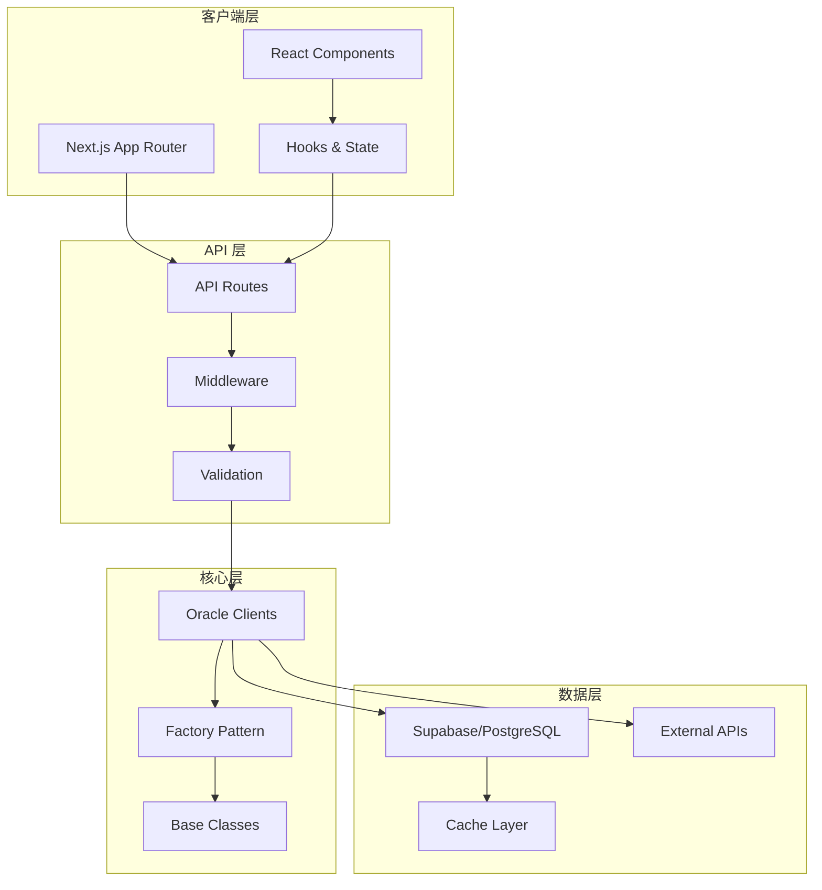

# Insight 架构文档

> Insight 区块链预言机数据分析平台的完整架构文档

## 文档导航

### 核心架构

- [预言机系统架构](./oracles.md) - 多预言机集成架构设计
- [状态管理](./state-management.md) - React Query 与 Zustand 状态管理策略
- [API 层架构](./api-layer.md) - 后端 API 设计与实现
- [前端架构](./frontend.md) - 前端组件与页面架构

### 架构概览



## 技术栈

| 类别 | 技术 | 版本 | 用途 |
|------|------|------|------|
| 框架 | Next.js | 16.1.6 | React 全栈框架 |
| UI 库 | React | 19.2.3 | 用户界面 |
| 语言 | TypeScript | 5.x | 类型安全 |
| 样式 | Tailwind CSS | 4.x | 原子化 CSS |
| 图表 | Recharts | 3.8.0 | 数据可视化 |
| 状态管理 | React Query | 5.90.21 | 服务端状态 |
| 客户端状态 | Zustand | 5.0.11 | UI 状态 |
| 数据库 | Supabase | 2.98.0 | PostgreSQL + Auth |
| 国际化 | next-intl | 4.8.3 | 多语言支持 |
| 动画 | Framer Motion | 12.36.0 | 交互动画 |

## 设计原则

### 1. Server Components 优先

- 默认使用 React Server Components
- 仅在需要客户端交互时使用 'use client'
- 减少客户端 JavaScript 体积

### 2. 类型安全

- TypeScript Strict Mode 启用
- 无 `any` 类型
- 完整的接口定义

### 3. 模块化设计

- 单一职责原则
- 清晰的模块边界
- 可插拔的架构

### 4. 性能优先

- 代码分割与懒加载
- 数据缓存策略
- 虚拟化长列表

## 目录结构

```
src/
├── app/                    # Next.js App Router
│   ├── [locale]/          # 国际化路由
│   ├── api/               # API Routes
│   └── ...
├── components/            # React 组件
│   ├── oracle/           # 预言机组件
│   ├── charts/           # 图表组件
│   └── ui/               # 基础 UI
├── hooks/                # 自定义 Hooks
│   ├── queries/          # React Query hooks
│   └── realtime/         # 实时数据 hooks
├── lib/                  # 核心库
│   ├── oracles/         # 预言机客户端
│   ├── api/             # API 层
│   └── errors/          # 错误处理
├── types/               # TypeScript 类型
└── i18n/                # 国际化
```

## 扩展阅读

- [开发指南](../development/README.md)
- [API 文档](../api/README.md)
- [部署指南](../deployment/README.md)
