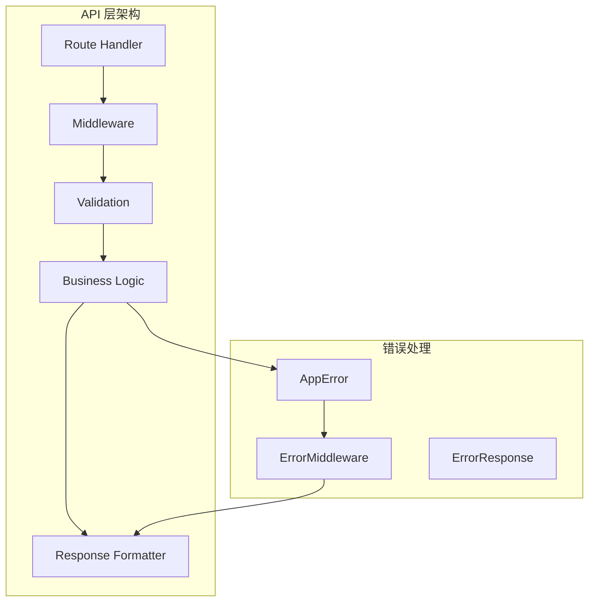

# API 层架构

> Insight 平台的后端 API 设计与实现

## 目录

- [概述](#概述)
- [路由结构](#路由结构)
- [中间件设计](#中间件设计)
- [错误处理](#错误处理)
- [验证逻辑](#验证逻辑)
- [响应处理](#响应处理)

## 概述

Insight 的 API 层基于 Next.js App Router 的 Route Handlers 构建，采用分层架构设计：



### 设计原则

1. **单一职责**：每个路由只处理一个资源
2. **统一响应格式**：所有 API 返回统一的响应结构
3. **完整错误处理**：分层错误处理和日志记录
4. **输入验证**：所有输入都经过严格验证
5. **缓存策略**：合理的 HTTP 缓存头设置

## 目录结构

```
src/lib/api/
├── client/                 # API 客户端
│   ├── ApiClient.ts       # API 客户端实现
│   ├── ApiError.ts        # API 错误类
│   ├── index.ts           # 导出入口
│   └── types.ts           # 类型定义
├── middleware/            # 中间件
│   ├── authMiddleware.ts       # 认证中间件
│   ├── errorMiddleware.ts      # 错误处理中间件
│   ├── rateLimitMiddleware.ts  # 限流中间件
│   ├── validationMiddleware.ts # 验证中间件
│   ├── loggingMiddleware.ts   # 日志中间件
│   └── index.ts               # 导出入口
├── versioning/            # API 版本控制
│   ├── constants.ts       # 版本常量
│   ├── middleware.ts      # 版本中间件
│   └── index.ts           # 导出入口
├── response/               # 响应格式化
│   ├── ApiResponse.ts     # 响应构建器
│   └── index.ts           # 导出入口
├── validation/            # 验证逻辑
│   ├── schemas.ts         # Zod 验证模式
│   ├── validators.ts      # 自定义验证器
│   └── index.ts           # 导出入口
├── handler.ts            # 路由处理函数
├── oracleHandlers.ts     # 预言机相关处理
└── utils.ts              # 工具函数
```

## 路由结构

### 目录组织

```
src/app/api/
├── oracles/
│   ├── [provider]/
│   │   └── route.ts          # GET /api/oracles/[provider]
│   └── route.ts              # GET /api/oracles
├── alerts/
│   ├── [id]/
│   │   └── route.ts          # GET/PUT/DELETE /api/alerts/[id]
│   ├── events/
│   │   └── route.ts          # GET /api/alerts/events
│   └── route.ts              # GET/POST /api/alerts
├── favorites/
│   └── route.ts              # GET/POST/DELETE /api/favorites
├── auth/
│   └── callback/
│       └── route.ts          # GET /api/auth/callback
├── snapshots/
│   └── route.ts              # GET/POST /api/snapshots
└── health/
    └── route.ts              # GET /api/health
```

## 中间件设计

### 中间件概览

| 中间件               | 文件位置                                         | 功能               |
| -------------------- | ------------------------------------------------ | ------------------ |
| authMiddleware       | `src/lib/api/middleware/authMiddleware.ts`       | JWT 认证、角色验证 |
| errorMiddleware      | `src/lib/api/middleware/errorMiddleware.ts`      | 统一错误处理       |
| rateLimitMiddleware  | `src/lib/api/middleware/rateLimitMiddleware.ts`  | 请求限流           |
| validationMiddleware | `src/lib/api/middleware/validationMiddleware.ts` | 输入验证           |
| loggingMiddleware    | `src/lib/api/middleware/loggingMiddleware.ts`    | 请求日志           |

### 中间件导出

```typescript
// src/lib/api/middleware/index.ts
export {
  createAuthMiddleware,
  getUserId,
  type AuthContext,
  type AuthMiddlewareOptions,
} from './authMiddleware';

export {
  createValidationMiddleware,
  validate,
  type ValidationMiddlewareOptions,
} from './validationMiddleware';

export {
  createLoggingMiddleware,
  logResponse,
  type LoggingMiddlewareOptions,
} from './loggingMiddleware';

export {
  createErrorMiddleware,
  defaultErrorMiddleware,
  type ErrorMiddlewareOptions,
} from './errorMiddleware';

export { createRateLimitMiddleware, type RateLimitMiddlewareOptions } from './rateLimitMiddleware';
```

### 1. 认证中间件 (authMiddleware)

```typescript
// src/lib/api/middleware/authMiddleware.ts
export interface AuthContext {
  userId: string;
  email?: string;
  role?: string;
}

export interface AuthMiddlewareOptions {
  required?: boolean;
  roles?: string[];
}

export type AuthMiddlewareResult =
  | { success: true; context: AuthContext }
  | { success: false; response: NextResponse };

export function createAuthMiddleware(options: AuthMiddlewareOptions = {}) {
  const { required = true, roles = [] } = options;

  return async (request: NextRequest): Promise<AuthMiddlewareResult> => {
    const authContext = await extractAuthContext(request);

    if (!authContext) {
      if (required) {
        return {
          success: false,
          response: NextResponse.json(
            ApiResponseBuilder.error('UNAUTHORIZED', 'Authentication required', {
              i18nKey: 'errors.authentication',
            }),
            { status: 401 }
          ),
        };
      }
      return { success: true, context: { userId: '' } };
    }

    if (roles.length > 0) {
      const userRole = authContext.role;
      if (!userRole || !roles.includes(userRole)) {
        return {
          success: false,
          response: NextResponse.json(
            ApiResponseBuilder.error('FORBIDDEN', 'Insufficient permissions', {
              i18nKey: 'errors.authorization',
              details: { requiredRoles: roles },
            }),
            { status: 403 }
          ),
        };
      }
    }

    return { success: true, context: authContext };
  };
}

export const requireAuth = createAuthMiddleware({ required: true });
export const optionalAuth = createAuthMiddleware({ required: false });

export function requireRoles(...roles: string[]) {
  return createAuthMiddleware({ required: true, roles });
}

export async function getUserId(request: NextRequest): Promise<string | null> {
  const authContext = await extractAuthContext(request);
  return authContext?.userId ?? null;
}
```

**核心功能：**

- `extractAuthContext` - 从请求头提取认证信息
- `createAuthMiddleware` - 创建认证中间件
- `requireAuth` - 必须认证
- `optionalAuth` - 可选认证
- `requireRoles` - 角色验证

### 2. 错误处理中间件 (errorMiddleware)

```typescript
// src/lib/api/middleware/errorMiddleware.ts
export interface ErrorMiddlewareOptions {
  includeStackTrace?: boolean;
  logErrors?: boolean;
}

export function createErrorMiddleware(options: ErrorMiddlewareOptions = {}) {
  const { includeStackTrace = false, logErrors = true } = options;

  return async (error: unknown, requestId?: string): Promise<NextResponse> => {
    if (logErrors) {
      if (isAppError(error)) {
        logger.error(`AppError: ${error.code} - ${error.message}`, error as Error, {
          statusCode: error.statusCode,
          details: error.details,
          requestId,
        });
      } else if (error instanceof Error) {
        logger.error('Unhandled error', error, { requestId });
      }
    }

    if (isAppError(error)) {
      const response = errorToResponse(error);
      if (requestId) {
        const body = await response.json();
        return NextResponse.json(
          { ...body, meta: { ...body.meta, requestId } },
          { status: response.status, headers: response.headers }
        );
      }
      return response;
    }

    if (error instanceof SyntaxError && error.message.includes('JSON')) {
      return NextResponse.json(
        ApiResponseBuilder.error('BAD_REQUEST', 'Invalid JSON in request body', { requestId }),
        { status: 400 }
      );
    }

    if (error instanceof Error) {
      const isNetworkError =
        error.message.includes('fetch') ||
        error.message.includes('network') ||
        error.message.includes('timeout');

      const response = ApiResponseBuilder.error('INTERNAL_ERROR', error.message, {
        retryable: isNetworkError,
        requestId,
      });

      return NextResponse.json(response, { status: 500 });
    }

    return NextResponse.json(
      ApiResponseBuilder.error('INTERNAL_ERROR', 'An unexpected error occurred', {
        retryable: true,
        requestId,
      }),
      { status: 500 }
    );
  };
}

export const defaultErrorMiddleware = createErrorMiddleware();
export const developmentErrorMiddleware = createErrorMiddleware({
  includeStackTrace: true,
  logErrors: true,
});
```

**核心功能：**

- 自动错误分类（AppError、SyntaxError、NetworkError）
- 错误日志记录
- 错误响应格式化
- 请求 ID 追踪

### 3. 限流中间件 (rateLimitMiddleware)

```typescript
// src/lib/api/middleware/rateLimitMiddleware.ts
export interface RateLimitMiddlewareOptions {
  windowMs?: number;
  maxRequests?: number;
  keyGenerator?: (request: NextRequest) => string;
  skipSuccessfulRequests?: boolean;
  skipFailedRequests?: boolean;
  handler?: (request: NextRequest, retryAfter: number) => NextResponse;
  preset?: 'strict' | 'moderate' | 'lenient' | 'api';
}

export type RateLimitMiddlewareResult =
  | { success: true; remaining: number; resetTime: number }
  | { success: false; response: NextResponse };

export function createRateLimitMiddleware(options: RateLimitMiddlewareOptions = {}) {
  const {
    windowMs = 60000,
    maxRequests = 100,
    keyGenerator = defaultKeyGenerator,
    handler = defaultRateLimitHandler,
  } = options;

  return async (request: NextRequest): Promise<RateLimitMiddlewareResult> => {
    const key = keyGenerator(request);
    const now = Date.now();
    const resetTime = now + windowMs;

    const entry = rateLimitStore.get(key);

    if (!entry || entry.resetTime < now) {
      rateLimitStore.set(key, { count: 1, resetTime });
      return { success: true, remaining: maxRequests - 1, resetTime };
    }

    if (entry.count >= maxRequests) {
      const retryAfter = Math.ceil((entry.resetTime - now) / 1000);
      return { success: false, response: handler(request, retryAfter) };
    }

    entry.count++;
    return { success: true, remaining: maxRequests - entry.count, resetTime };
  };
}

// 预设限流配置
export const strictRateLimit = createRateLimitMiddleware({
  windowMs: 60000,
  maxRequests: 20,
});

export const moderateRateLimit = createRateLimitMiddleware({
  windowMs: 60000,
  maxRequests: 60,
});

export const lenientRateLimit = createRateLimitMiddleware({
  windowMs: 60000,
  maxRequests: 200,
});

export const apiRateLimit = createRateLimitMiddleware({
  windowMs: 60000,
  maxRequests: 100,
});
```

**核心功能：**

- 基于内存的限流存储
- 自定义 keyGenerator（默认基于 IP 和路径）
- 预设限流配置（strict、moderate、lenient、api）
- 限流响应头（Retry-After、X-RateLimit-\*）

### 4. 验证中间件 (validationMiddleware)

```typescript
// src/lib/api/middleware/validationMiddleware.ts
export interface ValidationMiddlewareOptions {
  body?: z.Schema;
  query?: z.Schema;
  params?: z.Schema;
}

export function createValidationMiddleware(options: ValidationMiddlewareOptions) {
  return async (
    request: NextRequest
  ): Promise<{ success: true } | { success: false; response: NextResponse }> => {
    if (options.body && request.method !== 'GET') {
      const body = await request.json().catch(() => null);
      const result = options.body.safeParse(body);
      if (!result.success) {
        return {
          success: false,
          response: NextResponse.json(
            ApiResponseBuilder.error('VALIDATION_ERROR', 'Invalid request body', {
              details: result.error.errors,
            }),
            { status: 400 }
          ),
        };
      }
    }

    if (options.query) {
      const query = Object.fromEntries(request.nextUrl.searchParams);
      const result = options.query.safeParse(query);
      if (!result.success) {
        return {
          success: false,
          response: NextResponse.json(
            ApiResponseBuilder.error('VALIDATION_ERROR', 'Invalid query parameters', {
              details: result.error.errors,
            }),
            { status: 400 }
          ),
        };
      }
    }

    return { success: true };
  };
}

export function validate(schema: z.Schema) {
  return createValidationMiddleware({ body: schema });
}
```

### 5. 日志中间件 (loggingMiddleware)

```typescript
// src/lib/api/middleware/loggingMiddleware.ts
export interface LoggingMiddlewareOptions {
  logRequest?: boolean;
  logResponse?: boolean;
  logError?: boolean;
}

export function createLoggingMiddleware(options: LoggingMiddlewareOptions = {}) {
  const { logRequest = true, logResponse = true, logError = true } = options;

  return async (
    request: NextRequest,
    handler: (request: NextRequest) => Promise<NextResponse>
  ): Promise<NextResponse> => {
    const requestId = request.headers.get('x-request-id') || generateRequestId();
    const start = Date.now();

    if (logRequest) {
      logger.info(`Request: ${request.method} ${request.url}`, {
        requestId,
        method: request.method,
        path: request.nextUrl.pathname,
      });
    }

    try {
      const response = await handler(request);
      const duration = Date.now() - start;

      if (logResponse) {
        logger.info(`Response: ${response.status} (${duration}ms)`, {
          requestId,
          status: response.status,
          duration,
        });
      }

      response.headers.set('x-request-id', requestId);
      return response;
    } catch (error) {
      const duration = Date.now() - start;

      if (logError) {
        logger.error(
          `Error: ${error instanceof Error ? error.message : String(error)} (${duration}ms)`,
          {
            requestId,
            duration,
            error: error instanceof Error ? error.stack : String(error),
          }
        );
      }

      throw error;
    }
  };
}
```

### 中间件组合使用

```typescript
// 组合多个中间件
export const GET = withErrorHandler(
  withLogging(
    withRateLimit(
      withAuth(async (request, { user }) => {
        // 处理逻辑
      }),
      { limit: 100, window: 60 }
    )
  )
);
```

## API 版本控制

```typescript
// src/lib/api/versioning/middleware.ts
export function withVersionHeaders(response: NextResponse, version: string): NextResponse {
  response.headers.set('X-API-Version', version);
  return response;
}
```

## 错误处理

### 错误类层次结构

```typescript
// src/lib/errors/index.ts
export interface AppErrorOptions {
  message: string;
  code: string;
  statusCode: number;
  isOperational?: boolean;
  details?: Record<string, unknown>;
  cause?: Error;
}

export abstract class AppError extends Error {
  public readonly code: string;
  public readonly statusCode: number;
  public readonly isOperational: boolean;
  public readonly details?: Record<string, unknown>;

  constructor(options: AppErrorOptions) {
    super(options.message);
    this.name = this.constructor.name;
    this.code = options.code;
    this.statusCode = options.statusCode;
    this.isOperational = options.isOperational ?? true;
    this.details = options.details;

    if (options.cause) {
      this.cause = options.cause;
    }

    Error.captureStackTrace(this, this.constructor);
  }
}

export class ValidationError extends AppError {
  constructor(message: string, details?: Record<string, unknown>) {
    super({
      message,
      code: 'VALIDATION_ERROR',
      statusCode: 400,
      details,
    });
  }
}

export class NotFoundError extends AppError {
  constructor(resource: string, id?: string) {
    super({
      message: `${resource}${id ? ` with id "${id}"` : ''} not found`,
      code: 'NOT_FOUND',
      statusCode: 404,
    });
  }
}

export class UnauthorizedError extends AppError {
  constructor(message: string = 'Unauthorized') {
    super({
      message,
      code: 'UNAUTHORIZED',
      statusCode: 401,
    });
  }
}

export class DatabaseError extends AppError {
  constructor(message: string, options?: { cause?: Error }) {
    super({
      message,
      code: 'DATABASE_ERROR',
      statusCode: 500,
      isOperational: false,
      cause: options?.cause,
    });
  }
}
```

## 响应处理

### ApiResponseBuilder

```typescript
// src/lib/api/response/ApiResponse.ts
export class ApiResponseBuilder {
  static success<T>(data: T, meta?: Record<string, unknown>): ApiResponse<T> {
    return {
      data,
      meta: {
        timestamp: Date.now(),
        ...meta,
      },
    };
  }

  static error(
    code: string,
    message: string,
    details?: Record<string, unknown>
  ): ApiResponse<null> {
    return {
      error: {
        code,
        message,
        details,
      },
      meta: {
        timestamp: Date.now(),
      },
    };
  }
}

export function createJsonResponse<T>(
  data: T,
  options?: { status?: number; headers?: Record<string, string> }
): NextResponse {
  return NextResponse.json(ApiResponseBuilder.success(data), {
    status: options?.status || 200,
    headers: options?.headers,
  });
}

export function createCachedJsonResponse<T>(data: T, cacheConfig: CacheConfig): NextResponse {
  const response = ApiResponseBuilder.success(data);

  return NextResponse.json(response, {
    status: 200,
    headers: {
      'Cache-Control': `public, max-age=${cacheConfig.maxAge}${
        cacheConfig.staleWhileRevalidate
          ? `, stale-while-revalidate=${cacheConfig.staleWhileRevalidate}`
          : ''
      }`,
    },
  });
}

export function createPaginatedResponse<T>(
  items: T[],
  pagination: { page: number; pageSize: number; totalItems: number }
): NextResponse {
  const totalPages = Math.ceil(pagination.totalItems / pagination.pageSize);

  return NextResponse.json({
    data: {
      items,
      pagination: {
        page: pagination.page,
        pageSize: pagination.pageSize,
        totalItems: pagination.totalItems,
        totalPages,
        hasNextPage: pagination.page < totalPages,
        hasPrevPage: pagination.page > 1,
      },
    },
    meta: {
      timestamp: Date.now(),
    },
  });
}
```

### 响应示例

```typescript
// 成功响应（200 OK）
{
  "data": {
    "provider": "chainlink",
    "symbol": "BTC",
    "price": 45000.50,
    "timestamp": 1704067200000
  },
  "meta": {
    "timestamp": 1704067200000
  }
}

// 错误响应（400 Bad Request）
{
  "error": {
    "code": "VALIDATION_ERROR",
    "message": "Symbol is required",
    "details": { "field": "symbol" }
  },
  "meta": {
    "timestamp": 1704067200000
  }
}

// 分页响应（200 OK）
{
  "data": {
    "items": [...],
    "pagination": {
      "page": 1,
      "pageSize": 20,
      "totalItems": 100,
      "totalPages": 5,
      "hasNextPage": true,
      "hasPrevPage": false
    }
  },
  "meta": {
    "timestamp": 1704067200000
  }
}
```

## 最佳实践

### 1. 路由设计

```typescript
// ✅ 使用 RESTful 命名
GET    /api/oracles              # 获取所有预言机
GET    /api/oracles/chainlink    # 获取 Chainlink 数据
POST   /api/alerts               # 创建警报
DELETE /api/alerts/123           # 删除特定警报

// ❌ 避免使用动词
/getOracles                    # 不推荐
/createAlert                   # 不推荐
```

### 2. 状态码使用

| 状态码                    | 用途         |
| ------------------------- | ------------ |
| 200 OK                    | 成功         |
| 201 Created               | 创建成功     |
| 204 No Content            | 删除成功     |
| 400 Bad Request           | 请求参数错误 |
| 401 Unauthorized          | 未认证       |
| 403 Forbidden             | 无权限       |
| 404 Not Found             | 资源不存在   |
| 429 Too Many Requests     | 速率限制     |
| 500 Internal Server Error | 服务器错误   |

### 3. 缓存策略

```typescript
// 静态数据 - 长时间缓存
return createCachedJsonResponse(data, {
  maxAge: 3600,
  staleWhileRevalidate: 86400,
});

// 动态数据 - 短时间缓存
return createCachedJsonResponse(data, {
  maxAge: 30,
  staleWhileRevalidate: 60,
});
```

### 4. 安全性

```typescript
// ✅ 始终验证输入
const validation = validatePriceQuery({ symbol, chain });
if (!validation.valid) {
  return createErrorResponse('VALIDATION_ERROR', validation.errors.join(', '), 400);
}

// ✅ 使用参数化查询
const { data, error } = await supabase
  .from('prices')
  .select('*')
  .eq('symbol', symbol) // 参数化
  .single();
```
