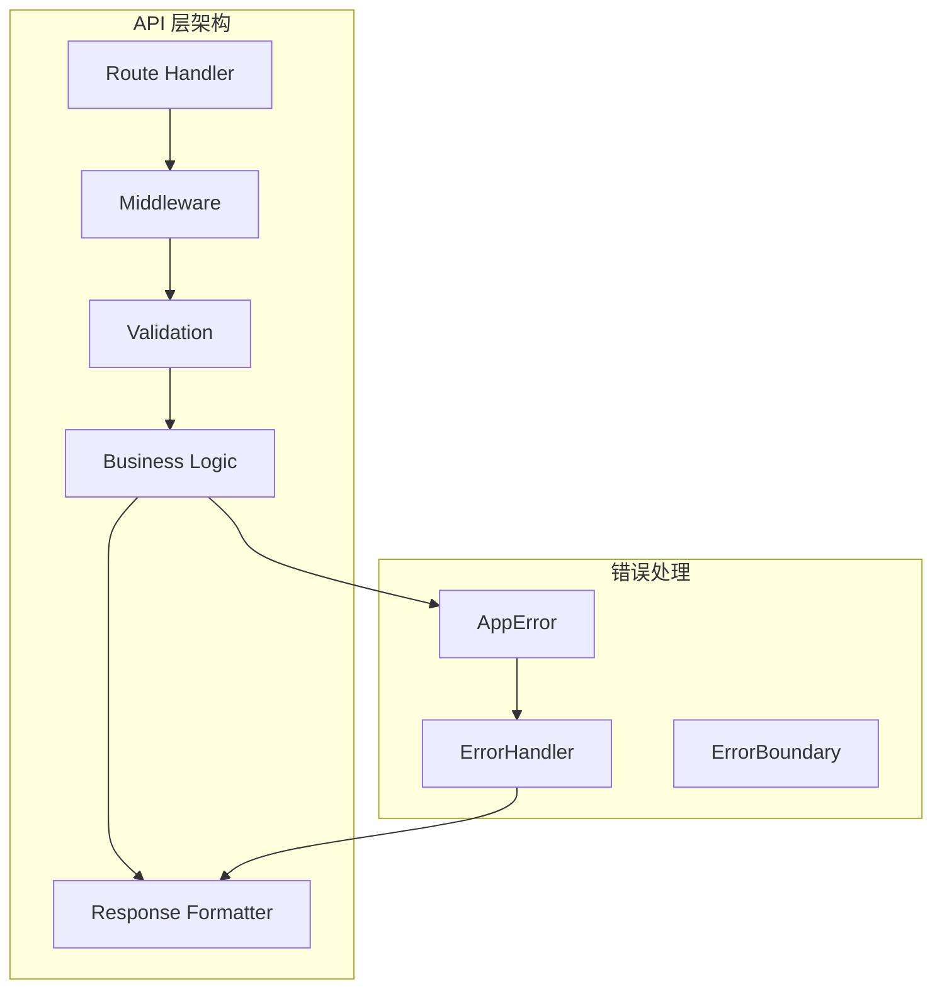

# API 层架构

> Insight 平台的后端 API 设计与实现

## 目录

- [概述](#概述)
- [路由结构](#路由结构)
- [中间件设计](#中间件设计)
- [错误处理](#错误处理)
- [验证逻辑](#验证逻辑)
- [响应处理](#响应处理)

## 概述

Insight 的 API 层基于 Next.js App Router 的 Route Handlers 构建，采用分层架构设计：



### 设计原则

1. **单一职责**：每个路由只处理一个资源
2. **统一响应格式**：所有 API 返回统一的响应结构
3. **完整错误处理**：分层错误处理和日志记录
4. **输入验证**：所有输入都经过严格验证
5. **缓存策略**：合理的 HTTP 缓存头设置

## 路由结构

### 目录组织

```
src/app/api/
├── oracles/
│   ├── [provider]/
│   │   └── route.ts          # GET /api/oracles/[provider]
│   └── route.ts              # GET /api/oracles
├── alerts/
│   ├── [id]/
│   │   └── route.ts          # GET/PUT/DELETE /api/alerts/[id]
│   ├── events/
│   │   └── route.ts          # GET /api/alerts/events
│   └── route.ts              # GET/POST /api/alerts
├── favorites/
│   └── route.ts              # GET/POST/DELETE /api/favorites
├── auth/
│   └── callback/
│       └── route.ts          # GET /api/auth/callback
├── snapshots/
│   └── route.ts              # GET/POST /api/snapshots
└── health/
    └── route.ts              # GET /api/health
```

### 路由实现示例

```typescript
// src/app/api/oracles/[provider]/route.ts
import { NextRequest, NextResponse } from 'next/server';
import { OracleClientFactory } from '@/lib/oracles/factory';
import { validateProvider } from '@/lib/api/validation';
import { createCachedJsonResponse, createErrorResponse } from '@/lib/api/response';
import { withErrorHandler, withAuth, withRateLimit } from '@/lib/api/middleware';
import { OracleProvider, Blockchain } from '@/types/oracle';

// GET /api/oracles/[provider]?symbol=BTC&chain=ethereum
export const GET = withErrorHandler(
  withRateLimit(
    async (request: NextRequest, { params }: { params: { provider: string } }) => {
      // 1. 验证 provider
      const validationError = validateProvider(params.provider);
      if (validationError) {
        return validationError;
      }

      // 2. 获取查询参数
      const searchParams = request.nextUrl.searchParams;
      const symbol = searchParams.get('symbol');
      const chain = searchParams.get('chain') as Blockchain | undefined;

      // 3. 验证必需参数
      if (!symbol) {
        return createErrorResponse('MISSING_PARAMS', 'Symbol is required', 400);
      }

      // 4. 获取数据
      const client = OracleClientFactory.getClient(params.provider as OracleProvider);
      const price = await client.getPrice(symbol, chain);

      // 5. 返回缓存响应
      return createCachedJsonResponse(price, {
        maxAge: 30,
        staleWhileRevalidate: 60,
      });
    },
    { limit: 100, window: 60 } // 每分钟 100 次请求
  )
);
```

### 多方法路由

```typescript
// src/app/api/alerts/route.ts
import { NextRequest, NextResponse } from 'next/server';
import { withAuth, withErrorHandler } from '@/lib/api/middleware';
import { validateAlertConfig } from '@/lib/api/validation';
import { createJsonResponse, createErrorResponse } from '@/lib/api/response';
import { supabase } from '@/lib/supabase/client';

// GET /api/alerts - 获取用户的所有警报
export const GET = withErrorHandler(
  withAuth(async (request: NextRequest, { user }) => {
    const { data, error } = await supabase
      .from('alerts')
      .select('*')
      .eq('user_id', user.id)
      .order('created_at', { ascending: false });

    if (error) {
      throw new DatabaseError('Failed to fetch alerts', { cause: error });
    }

    return createJsonResponse({ data, count: data?.length || 0 });
  })
);

// POST /api/alerts - 创建新警报
export const POST = withErrorHandler(
  withAuth(async (request: NextRequest, { user }) => {
    // 1. 解析请求体
    const body = await request.json();

    // 2. 验证输入
    const validation = validateAlertConfig(body);
    if (!validation.valid) {
      return createErrorResponse('VALIDATION_ERROR', validation.errors.join(', '), 400);
    }

    // 3. 创建警报
    const { data, error } = await supabase
      .from('alerts')
      .insert({
        ...body,
        user_id: user.id,
        created_at: new Date().toISOString(),
      })
      .select()
      .single();

    if (error) {
      throw new DatabaseError('Failed to create alert', { cause: error });
    }

    return createJsonResponse(data, { status: 201 });
  })
);
```

## 中间件设计

### 中间件组合

```typescript
// src/lib/api/middleware/index.ts
import { NextRequest, NextResponse } from 'next/server';
import { createErrorResponse } from '../response';
import { AppError } from '@/lib/errors';

// 中间件类型定义
type Middleware<T = {}> = (
  handler: (req: NextRequest, context: T) => Promise<NextResponse>
) => (req: NextRequest, context: T) => Promise<NextResponse>;

// 错误处理中间件
export function withErrorHandler<T>(
  handler: (req: NextRequest, context: T) => Promise<NextResponse>
): (req: NextRequest, context: T) => Promise<NextResponse> {
  return async (req: NextRequest, context: T) => {
    try {
      return await handler(req, context);
    } catch (error) {
      console.error('API Error:', error);

      if (error instanceof AppError) {
        return createErrorResponse(error.code, error.message, error.statusCode, error.details);
      }

      // 未知错误
      return createErrorResponse('INTERNAL_ERROR', 'An unexpected error occurred', 500);
    }
  };
}

// 认证中间件
interface AuthContext {
  user: {
    id: string;
    email: string;
  };
}

export function withAuth<T>(
  handler: (req: NextRequest, context: T & AuthContext) => Promise<NextResponse>
): Middleware<T> {
  return (handler) => async (req: NextRequest, context: T) => {
    const authHeader = req.headers.get('authorization');

    if (!authHeader?.startsWith('Bearer ')) {
      return createErrorResponse('UNAUTHORIZED', 'Missing or invalid authorization header', 401);
    }

    const token = authHeader.substring(7);
    const user = await verifyToken(token);

    if (!user) {
      return createErrorResponse('UNAUTHORIZED', 'Invalid or expired token', 401);
    }

    return handler(req, { ...context, user });
  };
}

// 速率限制中间件
interface RateLimitConfig {
  limit: number; // 请求次数限制
  window: number; // 时间窗口（秒）
}

export function withRateLimit<T>(
  handler: (req: NextRequest, context: T) => Promise<NextResponse>,
  config: RateLimitConfig
): (req: NextRequest, context: T) => Promise<NextResponse> {
  return async (req: NextRequest, context: T) => {
    const ip = req.ip || 'unknown';
    const key = `rate_limit:${ip}:${req.nextUrl.pathname}`;

    const { count, resetTime } = await checkRateLimit(key, config);

    if (count > config.limit) {
      return createErrorResponse(
        'RATE_LIMIT_EXCEEDED',
        'Too many requests, please try again later',
        429,
        { resetTime }
      );
    }

    const response = await handler(req, context);

    // 添加速率限制头
    response.headers.set('X-RateLimit-Limit', config.limit.toString());
    response.headers.set('X-RateLimit-Remaining', (config.limit - count).toString());
    response.headers.set('X-RateLimit-Reset', resetTime.toString());

    return response;
  };
}

// 日志中间件
export function withLogging<T>(
  handler: (req: NextRequest, context: T) => Promise<NextResponse>
): (req: NextRequest, context: T) => Promise<NextResponse> {
  return async (req: NextRequest, context: T) => {
    const start = Date.now();
    const requestId = generateRequestId();

    console.log(`[${requestId}] ${req.method} ${req.url} - Started`);

    try {
      const response = await handler(req, context);
      const duration = Date.now() - start;

      console.log(`[${requestId}] ${req.method} ${req.url} - ${response.status} (${duration}ms)`);

      response.headers.set('X-Request-Id', requestId);
      return response;
    } catch (error) {
      const duration = Date.now() - start;
      console.error(`[${requestId}] ${req.method} ${req.url} - Error (${duration}ms)`, error);
      throw error;
    }
  };
}
```

### 中间件组合使用

```typescript
// 组合多个中间件
export const GET = withErrorHandler(
  withLogging(
    withRateLimit(
      withAuth(async (request, { user }) => {
        // 处理逻辑
      }),
      { limit: 100, window: 60 }
    )
  )
);
```

## 错误处理

### 错误类层次结构

```typescript
// src/lib/errors/index.ts
export interface AppErrorOptions {
  message: string;
  code: string;
  statusCode: number;
  isOperational?: boolean;
  details?: Record<string, unknown>;
  cause?: Error;
}

export abstract class AppError extends Error {
  public readonly code: string;
  public readonly statusCode: number;
  public readonly isOperational: boolean;
  public readonly details?: Record<string, unknown>;

  constructor(options: AppErrorOptions) {
    super(options.message);
    this.name = this.constructor.name;
    this.code = options.code;
    this.statusCode = options.statusCode;
    this.isOperational = options.isOperational ?? true;
    this.details = options.details;

    if (options.cause) {
      this.cause = options.cause;
    }

    Error.captureStackTrace(this, this.constructor);
  }

  toJSON() {
    return {
      name: this.name,
      message: this.message,
      code: this.code,
      statusCode: this.statusCode,
      isOperational: this.isOperational,
      details: this.details,
    };
  }
}

// 具体错误类
export class ValidationError extends AppError {
  constructor(message: string, details?: Record<string, unknown>) {
    super({
      message,
      code: 'VALIDATION_ERROR',
      statusCode: 400,
      details,
    });
  }
}

export class NotFoundError extends AppError {
  constructor(resource: string, id?: string) {
    super({
      message: `${resource}${id ? ` with id "${id}"` : ''} not found`,
      code: 'NOT_FOUND',
      statusCode: 404,
    });
  }
}

export class UnauthorizedError extends AppError {
  constructor(message: string = 'Unauthorized') {
    super({
      message,
      code: 'UNAUTHORIZED',
      statusCode: 401,
    });
  }
}

export class ForbiddenError extends AppError {
  constructor(message: string = 'Forbidden') {
    super({
      message,
      code: 'FORBIDDEN',
      statusCode: 403,
    });
  }
}

export class DatabaseError extends AppError {
  constructor(message: string, options?: { cause?: Error }) {
    super({
      message,
      code: 'DATABASE_ERROR',
      statusCode: 500,
      isOperational: false,
      cause: options?.cause,
    });
  }
}

export class PriceFetchError extends AppError {
  constructor(
    message: string,
    details: {
      provider: OracleProvider;
      symbol: string;
      chain?: Blockchain;
      retryable: boolean;
    },
    cause?: Error
  ) {
    super({
      message,
      code: 'PRICE_FETCH_ERROR',
      statusCode: 502,
      details,
      cause,
    });
  }
}
```

### 全局错误处理

```typescript
// src/app/api/error-handler.ts
import { NextResponse } from 'next/server';
import { AppError } from '@/lib/errors';

export function handleApiError(error: unknown): NextResponse {
  // 记录错误到监控系统（如 Sentry）
  if (process.env.NODE_ENV === 'production') {
    // Sentry.captureException(error);
  }

  if (error instanceof AppError) {
    return NextResponse.json(
      {
        error: {
          code: error.code,
          message: error.message,
          details: error.details,
        },
      },
      { status: error.statusCode }
    );
  }

  // 未知错误
  console.error('Unhandled API error:', error);

  return NextResponse.json(
    {
      error: {
        code: 'INTERNAL_ERROR',
        message:
          process.env.NODE_ENV === 'development' ? String(error) : 'An unexpected error occurred',
      },
    },
    { status: 500 }
  );
}
```

## 验证逻辑

### 验证函数

```typescript
// src/lib/api/validation/index.ts
import { OracleProvider, Blockchain } from '@/types/oracle';
import { NextResponse } from 'next/server';
import { createErrorResponse } from '../response';

// Provider 验证
export function validateProvider(provider: string): NextResponse | null {
  const validProviders = Object.values(OracleProvider);

  if (!validProviders.includes(provider as OracleProvider)) {
    return createErrorResponse(
      'INVALID_PROVIDER',
      `Invalid provider. Must be one of: ${validProviders.join(', ')}`,
      400
    );
  }

  return null;
}

// Symbol 验证
export function validateSymbol(symbol: string): { valid: boolean; error?: string } {
  if (!symbol || typeof symbol !== 'string') {
    return { valid: false, error: 'Symbol is required' };
  }

  if (symbol.length < 1 || symbol.length > 20) {
    return { valid: false, error: 'Symbol must be between 1 and 20 characters' };
  }

  if (!/^[A-Z0-9]+$/.test(symbol.toUpperCase())) {
    return { valid: false, error: 'Symbol must contain only uppercase letters and numbers' };
  }

  return { valid: true };
}

// Chain 验证
export function validateChain(chain: string): { valid: boolean; error?: string } {
  const validChains = Object.values(Blockchain);

  if (!validChains.includes(chain as Blockchain)) {
    return {
      valid: false,
      error: `Invalid chain. Must be one of: ${validChains.join(', ')}`,
    };
  }

  return { valid: true };
}

// Alert 配置验证
interface AlertConfigValidation {
  valid: boolean;
  errors: string[];
}

export function validateAlertConfig(config: unknown): AlertConfigValidation {
  const errors: string[] = [];

  if (typeof config !== 'object' || config === null) {
    return { valid: false, errors: ['Config must be an object'] };
  }

  const c = config as Record<string, unknown>;

  // 验证 symbol
  if (!c.symbol || typeof c.symbol !== 'string') {
    errors.push('symbol is required and must be a string');
  }

  // 验证 provider
  const providerValidation = validateProvider(c.provider as string);
  if (providerValidation) {
    errors.push('Invalid provider');
  }

  // 验证 conditionType
  const validConditionTypes = ['above', 'below', 'change_percent'];
  if (!validConditionTypes.includes(c.conditionType as string)) {
    errors.push(`conditionType must be one of: ${validConditionTypes.join(', ')}`);
  }

  // 验证 targetValue
  if (typeof c.targetValue !== 'number' || c.targetValue <= 0) {
    errors.push('targetValue must be a positive number');
  }

  return {
    valid: errors.length === 0,
    errors,
  };
}

// 请求体验证（使用 Zod）
import { z } from 'zod';

const PriceQuerySchema = z.object({
  symbol: z.string().min(1).max(20).toUpperCase(),
  chain: z.enum(Object.values(Blockchain) as [string, ...string[]]).optional(),
  period: z.coerce.number().int().min(1).max(365).default(24),
});

export type PriceQueryInput = z.infer<typeof PriceQuerySchema>;

export function validatePriceQuery(input: unknown): {
  valid: boolean;
  data?: PriceQueryInput;
  errors?: string[];
} {
  const result = PriceQuerySchema.safeParse(input);

  if (result.success) {
    return { valid: true, data: result.data };
  }

  return {
    valid: false,
    errors: result.error.errors.map((e) => `${e.path.join('.')}: ${e.message}`),
  };
}
```

## 响应处理

### 响应辅助函数

```typescript
// src/lib/api/response/index.ts
import { NextResponse } from 'next/server';

interface ApiResponse<T = unknown> {
  data?: T;
  error?: {
    code: string;
    message: string;
    details?: Record<string, unknown>;
  };
  meta?: {
    timestamp: number;
    requestId?: string;
  };
}

interface CacheConfig {
  maxAge: number; // 秒
  staleWhileRevalidate?: number; // 秒
  private?: boolean;
}

// 成功响应
export function createJsonResponse<T>(
  data: T,
  options?: {
    status?: number;
    headers?: Record<string, string>;
  }
): NextResponse {
  const response: ApiResponse<T> = {
    data,
    meta: {
      timestamp: Date.now(),
    },
  };

  return NextResponse.json(response, {
    status: options?.status || 200,
    headers: options?.headers,
  });
}

// 带缓存的成功响应
export function createCachedJsonResponse<T>(
  data: T,
  cacheConfig: CacheConfig,
  options?: {
    status?: number;
  }
): NextResponse {
  const response: ApiResponse<T> = {
    data,
    meta: {
      timestamp: Date.now(),
    },
  };

  const cacheControl = cacheConfig.private
    ? `private, max-age=${cacheConfig.maxAge}${
        cacheConfig.staleWhileRevalidate
          ? `, stale-while-revalidate=${cacheConfig.staleWhileRevalidate}`
          : ''
      }`
    : `public, max-age=${cacheConfig.maxAge}${
        cacheConfig.staleWhileRevalidate
          ? `, stale-while-revalidate=${cacheConfig.staleWhileRevalidate}`
          : ''
      }`;

  return NextResponse.json(response, {
    status: options?.status || 200,
    headers: {
      'Cache-Control': cacheControl,
    },
  });
}

// 错误响应
export function createErrorResponse(
  code: string,
  message: string,
  status: number = 500,
  details?: Record<string, unknown>
): NextResponse {
  const response: ApiResponse = {
    error: {
      code,
      message,
      details,
    },
    meta: {
      timestamp: Date.now(),
    },
  };

  return NextResponse.json(response, { status });
}

// 分页响应
interface PaginatedData<T> {
  items: T[];
  pagination: {
    page: number;
    pageSize: number;
    totalItems: number;
    totalPages: number;
    hasNextPage: boolean;
    hasPrevPage: boolean;
  };
}

export function createPaginatedResponse<T>(
  items: T[],
  pagination: {
    page: number;
    pageSize: number;
    totalItems: number;
  }
): NextResponse {
  const totalPages = Math.ceil(pagination.totalItems / pagination.pageSize);

  const response: ApiResponse<PaginatedData<T>> = {
    data: {
      items,
      pagination: {
        page: pagination.page,
        pageSize: pagination.pageSize,
        totalItems: pagination.totalItems,
        totalPages,
        hasNextPage: pagination.page < totalPages,
        hasPrevPage: pagination.page > 1,
      },
    },
    meta: {
      timestamp: Date.now(),
    },
  };

  return NextResponse.json(response);
}
```

### 响应示例

```typescript
// 成功响应（200 OK）
{
  "data": {
    "provider": "chainlink",
    "symbol": "BTC",
    "price": 45000.50,
    "timestamp": 1704067200000,
    "confidence": 0.98,
    "change24h": 1200.50,
    "change24hPercent": 2.74
  },
  "meta": {
    "timestamp": 1704067200000
  }
}

// 错误响应（400 Bad Request）
{
  "error": {
    "code": "VALIDATION_ERROR",
    "message": "Symbol is required",
    "details": {
      "field": "symbol"
    }
  },
  "meta": {
    "timestamp": 1704067200000
  }
}

// 分页响应（200 OK）
{
  "data": {
    "items": [...],
    "pagination": {
      "page": 1,
      "pageSize": 20,
      "totalItems": 100,
      "totalPages": 5,
      "hasNextPage": true,
      "hasPrevPage": false
    }
  },
  "meta": {
    "timestamp": 1704067200000
  }
}
```

## API 客户端

### 前端 API 客户端

```typescript
// src/lib/api/client/ApiClient.ts
import { ApiError } from './ApiError';

interface RequestConfig extends RequestInit {
  timeout?: number;
  retries?: number;
}

export class ApiClient {
  private baseUrl: string;
  private defaultConfig: RequestConfig;

  constructor(baseUrl: string = '/api', defaultConfig: RequestConfig = {}) {
    this.baseUrl = baseUrl;
    this.defaultConfig = {
      timeout: 10000,
      retries: 3,
      ...defaultConfig,
    };
  }

  async get<T>(path: string, config?: RequestConfig): Promise<T> {
    return this.request<T>('GET', path, undefined, config);
  }

  async post<T>(path: string, body: unknown, config?: RequestConfig): Promise<T> {
    return this.request<T>('POST', path, body, config);
  }

  async put<T>(path: string, body: unknown, config?: RequestConfig): Promise<T> {
    return this.request<T>('PUT', path, body, config);
  }

  async delete<T>(path: string, config?: RequestConfig): Promise<T> {
    return this.request<T>('DELETE', path, undefined, config);
  }

  private async request<T>(
    method: string,
    path: string,
    body?: unknown,
    config?: RequestConfig
  ): Promise<T> {
    const url = `${this.baseUrl}${path}`;
    const mergedConfig = { ...this.defaultConfig, ...config };

    const headers: Record<string, string> = {
      'Content-Type': 'application/json',
      ...mergedConfig.headers,
    };

    // 添加认证头
    const token = getAuthToken();
    if (token) {
      headers['Authorization'] = `Bearer ${token}`;
    }

    let lastError: Error | undefined;

    for (let attempt = 0; attempt < (mergedConfig.retries || 1); attempt++) {
      try {
        const controller = new AbortController();
        const timeoutId = setTimeout(() => controller.abort(), mergedConfig.timeout);

        const response = await fetch(url, {
          method,
          headers,
          body: body ? JSON.stringify(body) : undefined,
          signal: controller.signal,
          ...mergedConfig,
        });

        clearTimeout(timeoutId);

        if (!response.ok) {
          const errorData = await response.json().catch(() => null);
          throw new ApiError(
            errorData?.error?.message || `API request failed: ${response.statusText}`,
            response.status,
            errorData?.error?.code,
            errorData?.error?.details
          );
        }

        const result = await response.json();
        return result.data as T;
      } catch (error) {
        lastError = error as Error;

        // 不重试客户端错误（4xx）
        if (error instanceof ApiError && error.statusCode < 500) {
          throw error;
        }

        // 指数退避
        if (attempt < (mergedConfig.retries || 1) - 1) {
          await delay(Math.min(1000 * 2 ** attempt, 10000));
        }
      }
    }

    throw lastError;
  }
}

// 创建默认实例
export const apiClient = new ApiClient();

// 使用示例
export async function fetchOraclePrice(provider: string, symbol: string): Promise<PriceData> {
  return apiClient.get<PriceData>(`/oracles/${provider}?symbol=${encodeURIComponent(symbol)}`);
}
```

## 最佳实践

### 1. 路由设计

```typescript
// ✅ 使用 RESTful 命名
/api/oracles              # 获取所有预言机
/api/oracles/chainlink    # 获取 Chainlink 数据
/api/alerts               # 获取/创建警报
/api/alerts/123           # 获取/更新/删除特定警报

// ❌ 避免使用动词
/getOracles               # 不推荐
/createAlert              # 不推荐
```

### 2. HTTP 方法使用

```typescript
GET    /api/resource      # 获取资源列表
GET    /api/resource/:id  # 获取单个资源
POST   /api/resource      # 创建资源
PUT    /api/resource/:id  # 完整更新资源
PATCH  /api/resource/:id  # 部分更新资源
DELETE /api/resource/:id  # 删除资源
```

### 3. 状态码使用

```typescript
200 OK                    # 成功
201 Created               # 创建成功
204 No Content            # 删除成功
400 Bad Request           # 请求参数错误
401 Unauthorized          # 未认证
403 Forbidden             # 无权限
404 Not Found             # 资源不存在
429 Too Many Requests     # 速率限制
500 Internal Server Error # 服务器错误
502 Bad Gateway           # 上游服务错误
```

### 4. 缓存策略

```typescript
// 静态数据 - 长时间缓存
return createCachedJsonResponse(data, {
  maxAge: 3600, // 1 小时
  staleWhileRevalidate: 86400, // 24 小时
});

// 动态数据 - 短时间缓存
return createCachedJsonResponse(data, {
  maxAge: 30, // 30 秒
  staleWhileRevalidate: 60, // 1 分钟
});

// 用户数据 - 私有缓存
return createCachedJsonResponse(data, {
  maxAge: 300, // 5 分钟
  private: true,
});
```

### 5. 安全性

```typescript
// 始终验证输入
const validation = validatePriceQuery({ symbol, chain });
if (!validation.valid) {
  return createErrorResponse('VALIDATION_ERROR', validation.errors.join(', '), 400);
}

// 使用参数化查询防止 SQL 注入
const { data, error } = await supabase
  .from('prices')
  .select('*')
  .eq('symbol', symbol) // 参数化
  .single();

// 限制返回字段
const { data } = await supabase
  .from('users')
  .select('id, email, name') // 只选择需要的字段
  .eq('id', userId);
```
