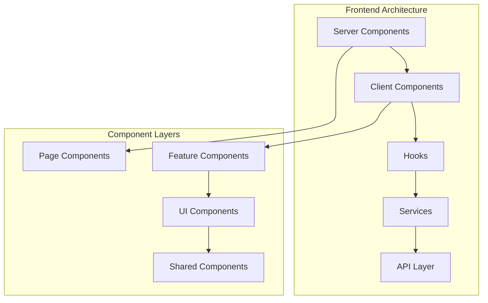

# Frontend Architecture

> Frontend component and page architecture for the Insight platform

## Table of Contents

- [Overview](#overview)
- [Component Architecture](#component-architecture)
- [Page Structure](#page-structure)
- [Routing Design](#routing-design)
- [Performance Optimization](#performance-optimization)

## Overview

The Insight frontend is built on Next.js 16 App Router, adopting a Server Components-first architecture design:



### Design Principles

1. **Server Components First**: Use Server Components by default to reduce client-side JS
2. **Progressive Enhancement**: Core functionality works without JavaScript, interactive features are progressively enhanced
3. **Component Reuse**: Establish clear component hierarchy to maximize code reuse
4. **Performance First**: Code splitting, lazy loading, virtualization, and other optimization techniques

## Component Architecture

### Component Layers

```
src/components/
├── alerts/            # Alert components
├── charts/            # General charts
├── data-transparency/ # Data transparency components
├── error-boundary/    # Error boundary components
├── export/            # Export components
├── favorites/         # Favorites components
├── navigation/        # Navigation components
├── realtime/          # Real-time components
├── search/            # Search components
├── settings/          # Settings components
├── shortcuts/         # Keyboard shortcuts
├── ui/                # Base UI components
└── accessibility/     # Accessibility components
```

### Component Categories

| Layer   | Purpose               | Examples                           | Dependencies                  |
| ------- | --------------------- | ---------------------------------- | ----------------------------- |
| Page    | Page-level components | `ChainlinkPage`, `CrossOraclePage` | Can use all lower layers      |
| Feature | Feature components    | `PriceChart`, `AlertConfig`        | Uses UI and Shared components |
| UI      | Base UI               | `Button`, `Card`, `Input`          | Only uses Shared components   |
| Shared  | Shared utilities      | `LoadingState`, `ErrorFallback`    | No dependencies               |

### Server Components

```typescript
// src/app/[locale]/chainlink/page.tsx
import { OracleClientFactory } from '@/lib/oracles/factory';
import { OracleProvider } from '@/types/oracle';
import { ChainlinkHero } from './components/ChainlinkHero';
import { MarketDataPanel } from '@/components/oracle/panels';

export default async function ChainlinkPage({
  params: { locale },
}: {
  params: { locale: string };
}) {
  const client = OracleClientFactory.getClient(OracleProvider.CHAINLINK);
  const initialData = await client.getPrice('BTC');

  return (
    <div className="space-y-8">
      <ChainlinkHero />
      <MarketDataPanel
        provider={OracleProvider.CHAINLINK}
        initialData={initialData}
      />
    </div>
  );
}
```

### Client Components

```typescript
// components/oracle/charts/PriceChart.tsx
'use client';

import { useState, useCallback } from 'react';
import {
  LineChart,
  Line,
  XAxis,
  YAxis,
  Tooltip,
  ResponsiveContainer,
} from 'recharts';
import { usePriceHistory } from '@/hooks/queries';
import { Card } from '@/components/ui/Card';

interface PriceChartProps {
  provider: OracleProvider;
  symbol: string;
  chain?: Blockchain;
}

export function PriceChart({ provider, symbol, chain }: PriceChartProps) {
  const [timeRange, setTimeRange] = useState<TimeRange>('24H');
  const { data, isLoading } = usePriceHistory(provider, symbol, chain);

  const handleTimeRangeChange = useCallback((range: TimeRange) => {
    setTimeRange(range);
  }, []);

  if (isLoading) {
    return <ChartSkeleton />;
  }

  return (
    <Card>
      <div className="flex items-center justify-between mb-4">
        <h3 className="text-lg font-semibold">
          {symbol} Price History
        </h3>
        <TimeRangeSelector
          value={timeRange}
          onChange={handleTimeRangeChange}
        />
      </div>
      <ResponsiveContainer width="100%" height={300}>
        <LineChart data={data}>
          <XAxis dataKey="timestamp" tickFormatter={formatDate} />
          <YAxis tickFormatter={formatPrice} />
          <Tooltip content={<CustomTooltip />} />
          <Line
            type="monotone"
            dataKey="price"
            stroke="#3b82f6"
            strokeWidth={2}
            dot={false}
          />
        </LineChart>
      </ResponsiveContainer>
    </Card>
  );
}
```

### Compound Component Pattern

```typescript
// components/oracle/panels/MarketDataPanel.tsx
import { createContext, useContext } from 'react';

interface MarketDataContextValue {
  provider: OracleProvider;
  symbol: string;
  data: PriceData;
}

const MarketDataContext = createContext<MarketDataContextValue | null>(null);

export function MarketDataPanel({
  provider,
  symbol,
  children,
}: MarketDataPanelProps) {
  const { data } = useOraclePrice(provider, symbol);

  return (
    <MarketDataContext.Provider value={{ provider, symbol, data }}>
      <div className="rounded-lg border border-gray-200 bg-white p-6">
        {children}
      </div>
    </MarketDataContext.Provider>
  );
}

export function MarketDataHeader() {
  const { symbol, data } = useContext(MarketDataContext)!;

  return (
    <div className="flex items-center justify-between">
      <h2 className="text-2xl font-bold">{symbol}</h2>
      <PriceDisplay price={data.price} change={data.change24hPercent} />
    </div>
  );
}

export function MarketDataStats() {
  const { data } = useContext(MarketDataContext)!;

  return (
    <div className="grid grid-cols-3 gap-4 mt-4">
      <Stat label="24h High" value={data.high24h} />
      <Stat label="24h Low" value={data.low24h} />
      <Stat label="Volume" value={data.volume24h} />
    </div>
  );
}
```

## Page Structure

### Page Template

```typescript
// components/oracle/shared/OraclePageTemplate.tsx
interface OraclePageTemplateProps {
  provider: OracleProvider;
  title: string;
  description: string;
  children?: React.ReactNode;
}

export function OraclePageTemplate({
  provider,
  title,
  description,
  children,
}: OraclePageTemplateProps) {
  return (
    <div className="min-h-screen bg-gray-50">
      <section className="bg-white border-b border-gray-200">
        <div className="max-w-7xl mx-auto px-4 sm:px-6 lg:px-8 py-12">
          <div className="flex items-center gap-4">
            <OracleLogo provider={provider} size="lg" />
            <div>
              <h1 className="text-3xl font-bold text-gray-900">{title}</h1>
              <p className="mt-2 text-lg text-gray-600">{description}</p>
            </div>
          </div>
        </div>
      </section>

      <main className="max-w-7xl mx-auto px-4 sm:px-6 lg:px-8 py-8">
        <div className="grid grid-cols-1 lg:grid-cols-3 gap-8">
          <aside className="lg:col-span-1">
            <OracleSidebar provider={provider} />
          </aside>
          <div className="lg:col-span-2 space-y-6">
            {children}
          </div>
        </div>
      </main>
    </div>
  );
}
```

### Page Implementation

```typescript
// src/app/[locale]/chainlink/page.tsx
import { OraclePageTemplate } from '@/components/oracle/shared';
import { MarketDataPanel } from '@/components/oracle/panels';
import { PriceChart } from '@/components/oracle/charts';
import { NetworkHealthPanel } from '@/components/oracle/panels';
import { OracleProvider } from '@/types/oracle';

export const metadata = {
  title: 'Chainlink | Insight Oracle Analytics',
  description: 'Real-time Chainlink price feeds and network analytics',
};

export default function ChainlinkPage() {
  return (
    <OraclePageTemplate
      provider={OracleProvider.CHAINLINK}
      title="Chainlink"
      description="Decentralized oracle network providing reliable price feeds"
    >
      <MarketDataPanel provider={OracleProvider.CHAINLINK} symbol="BTC" />
      <PriceChart provider={OracleProvider.CHAINLINK} symbol="BTC" />
      <NetworkHealthPanel provider={OracleProvider.CHAINLINK} />
    </OraclePageTemplate>
  );
}
```

### Layout Components

```typescript
// src/app/[locale]/layout.tsx
import { Navbar } from '@/components/Navbar';
import { Footer } from '@/components/Footer';
import { ReactQueryProvider } from '@/providers/ReactQueryProvider';
import { I18nProvider } from '@/providers/I18nProvider';

export default async function LocaleLayout({
  children,
  params: { locale },
}: {
  children: React.ReactNode;
  params: { locale: string };
}) {
  const messages = await getMessages(locale);

  return (
    <I18nProvider locale={locale} messages={messages}>
      <ReactQueryProvider>
        <div className="flex flex-col min-h-screen">
          <Navbar />
          <div className="flex-1">{children}</div>
          <Footer />
        </div>
      </ReactQueryProvider>
    </I18nProvider>
  );
}
```

## Routing Design

### Route Structure

All pages use the `[locale]/` route pattern for internationalization:

```
src/app/
├── [locale]/                         # Internationalized route group
│   ├── page.tsx                     # Home page /
│   ├── layout.tsx                   # Locale layout
│   │
│   ├── price-query/                 # Price query
│   │   └── page.tsx                 # /[locale]/price-query
│   │
│   ├── cross-oracle/                # Oracle comparison
│   │   └── page.tsx                 # /[locale]/cross-oracle
│   │
│   ├── cross-chain/                 # Cross-chain comparison
│   │   └── page.tsx                 # /[locale]/cross-chain
│   │
│   ├── alerts/                      # Alerts
│   │   └── page.tsx                 # /[locale]/alerts
│   │
│   ├── favorites/                   # Favorites
│   │   └── page.tsx                 # /[locale]/favorites
│   │
│   ├── settings/                    # Settings
│   │   └── page.tsx                 # /[locale]/settings
│   │
│   ├── docs/                        # Documentation
│   │   └── page.tsx                 # /[locale]/docs
│   │
│   ├── login/                       # Login
│   │   └── page.tsx                 # /[locale]/login
│   │
│   ├── register/                    # Register
│   │   └── page.tsx                 # /[locale]/register
│   │
│   └── auth/                        # Authentication related
│       ├── forgot-password/
│       │   └── page.tsx             # /[locale]/auth/forgot-password
│       ├── resend-verification/
│       │   └── page.tsx             # /[locale]/auth/resend-verification
│       ├── reset-password/
│       │   └── page.tsx             # /[locale]/auth/reset-password
│       └── verify-email/
│           └── page.tsx             # /[locale]/auth/verify-email
│
├── api/                             # API routes
│   ├── oracles/                     # Oracle data
│   ├── alerts/                      # Alert management
│   ├── favorites/                   # Favorite management
│   ├── auth/                        # Authentication
│   ├── health/                      # Health check
│   └── prices/                      # Price data
│
├── error.tsx                        # Global error page
├── not-found.tsx                    # 404 page
└── layout.tsx                       # Root layout
```

### Dynamic Routes

```typescript
// src/app/[locale]/snapshot/[id]/page.tsx
interface SnapshotPageProps {
  params: {
    locale: string;
    id: string;
  };
}

export default async function SnapshotPage({ params }: SnapshotPageProps) {
  const { id } = params;

  const snapshot = await getSnapshot(id);

  if (!snapshot) {
    notFound();
  }

  return (
    <div className="container mx-auto py-8">
      <SnapshotView snapshot={snapshot} />
    </div>
  );
}

export async function generateStaticParams() {
  const snapshots = await getPopularSnapshots();

  return snapshots.map((snapshot) => ({
    id: snapshot.id,
  }));
}

export async function generateMetadata({ params }: SnapshotPageProps) {
  const snapshot = await getSnapshot(params.id);

  return {
    title: `${snapshot.name} | Insight Snapshot`,
    description: snapshot.description,
  };
}
```

## Performance Optimization

### Code Splitting

```typescript
import dynamic from 'next/dynamic';

const PriceChart = dynamic(
  () => import('@/components/oracle/charts/PriceChart'),
  {
    loading: () => <ChartSkeleton />,
    ssr: false,
  }
);

const HeavyComponent = dynamic(
  () => import('@/components/HeavyComponent'),
  { loading: () => <Loading /> }
);

function Dashboard() {
  const handleMouseEnter = () => {
    import('@/components/HeavyComponent');
  };

  return (
    <div onMouseEnter={handleMouseEnter}>
      <HeavyComponent />
    </div>
  );
}
```

### Data Prefetching

```typescript
import { dehydrate, HydrationBoundary } from '@tanstack/react-query';
import { getQueryClient } from '@/lib/queries/client';

export default async function OraclePage() {
  const queryClient = getQueryClient();

  await queryClient.prefetchQuery({
    queryKey: ['oracles', 'chainlink', 'price', 'BTC'],
    queryFn: () => fetchPrice('chainlink', 'BTC'),
  });

  return (
    <HydrationBoundary state={dehydrate(queryClient)}>
      <ChainlinkPage />
    </HydrationBoundary>
  );
}
```

### Component-Level Optimization

```typescript
import { memo, useMemo, useCallback } from 'react';

interface PriceListProps {
  prices: PriceData[];
  onSelect: (price: PriceData) => void;
}

export const PriceList = memo(function PriceList({
  prices,
  onSelect,
}: PriceListProps) {
  const sortedPrices = useMemo(() => {
    return [...prices].sort((a, b) => b.price - a.price);
  }, [prices]);

  const handleSelect = useCallback(
    (price: PriceData) => {
      onSelect(price);
    },
    [onSelect]
  );

  return (
    <ul>
      {sortedPrices.map((price) => (
        <PriceItem
          key={price.symbol}
          price={price}
          onSelect={handleSelect}
        />
      ))}
    </ul>
  );
});
```

## Best Practices

### 1. Component Design

```typescript
function PriceCard({ price }: { price: PriceData }) {
  return (
    <Card>
      <PriceHeader price={price} />
      <PriceValue price={price.price} />
      <PriceChange change={price.change24hPercent} />
    </Card>
  );
}

function Card({ children, className }: CardProps) {
  return (
    <div className={`rounded-lg border p-4 ${className}`}>
      {children}
    </div>
  );
}
```

### 2. State Management

```typescript
function Parent() {
  const [count, setCount] = useState(0);

  return (
    <>
      <ChildA count={count} />
      <ChildB onIncrement={() => setCount((c) => c + 1)} />
    </>
  );
}

const ThemeContext = createContext<Theme>('light');

function App() {
  return (
    <ThemeContext.Provider value="dark">
      <DeepTree />
    </ThemeContext.Provider>
  );
}
```

### 3. Error Handling

```typescript
function Chart({ data }: { data?: ChartData[] }) {
  if (!data || data.length === 0) {
    return <EmptyState message="No data available" />;
  }

  return <ChartRenderer data={data} />;
}
```

### 4. Style Management

```typescript
function Button({
  variant = 'primary',
  size = 'medium',
  children,
}: ButtonProps) {
  return (
    <button
      className={cn(
        'inline-flex items-center justify-center font-medium rounded-md',
        'transition-colors focus:outline-none focus:ring-2',
        variant === 'primary' && 'bg-blue-600 text-white hover:bg-blue-700',
        variant === 'secondary' && 'bg-gray-100 text-gray-900 hover:bg-gray-200',
        size === 'small' && 'px-3 py-1.5 text-sm',
        size === 'medium' && 'px-4 py-2 text-base',
        size === 'large' && 'px-6 py-3 text-lg'
      )}
    >
      {children}
    </button>
  );
}
```

## Development Tools

### React Developer Tools

- Component tree inspection
- Props and State viewing
- Performance analysis

### Next.js Analysis

```bash
ANALYZE=true npm run build
next build --profile
```

### Performance Monitoring

```typescript
export function reportWebVitals(metric: NextWebVitalsMetric) {
  console.log(metric);
}

export { reportWebVitals } from '@/lib/performance';
```
