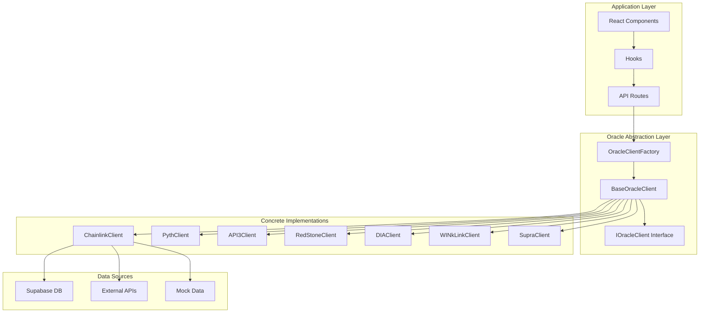
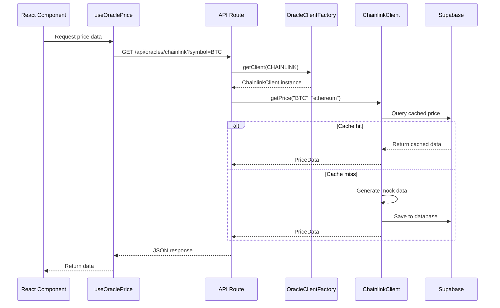

# Oracle System Architecture

> Multi-oracle integration architecture design for the Insight platform

## Table of Contents

- [System Overview](#system-overview)
- [Architecture Diagram](#architecture-diagram)
- [Core Components](#core-components)
- [Data Flow](#data-flow)
- [Extension Guide](#extension-guide)

## System Overview

The Insight platform supports multiple blockchain oracle providers, adopting a unified abstraction layer design that makes integration of different oracles simple and consistent.

### Supported Oracles

| Oracle       | Identifier  | File Location                    | Primary Chains              | Features                   |
| ------------ | ----------- | -------------------------------- | --------------------------- | -------------------------- |
| Chainlink    | `chainlink` | `src/lib/oracles/chainlink.ts`   | Ethereum, Arbitrum, Polygon | Market Leader              |
| Pyth Network | `pyth`      | `src/lib/oracles/pythNetwork.ts` | Solana, Ethereum            | Low-latency Financial Data |
| API3         | `api3`      | `src/lib/oracles/api3.ts`        | Ethereum, Polygon           | First-party Oracle         |
| RedStone     | `redstone`  | `src/lib/oracles/redstone.ts`    | Arbitrum, Ethereum          | Efficient Data Push        |
| DIA          | `dia`       | `src/lib/oracles/dia.ts`         | Multi-chain                 | Transparent Data Source    |
| WINkLink     | `winklink`  | `src/lib/oracles/winklink.ts`    | Tron                        | TRON Ecosystem             |
| Supra        | `supra`     | `src/lib/oracles/clients/supra.ts` | Ethereum                 | Verifiable Randomness      |

## Architecture Diagram

### Overall Architecture



### Class Hierarchy

```mermaid
classDiagram
    class IOracleClient {
        <<interface>>
        +name: OracleProvider
        +supportedChains: Blockchain[]
        +getPrice(symbol, chain): Promise~PriceData~
        +getHistoricalPrices(symbol, chain, period): Promise~PriceData[]~
    }

    class BaseOracleClient {
        <<abstract>>
        #config: OracleClientConfig
        +constructor(config?)
        +getPrice(symbol, chain)*: Promise~PriceData~
        +getHistoricalPrices(symbol, chain, period)*: Promise~PriceData[]~
        #createError(message, code): OracleError
        #generateMockPrice(symbol, basePrice, chain): PriceData
        #generateMockHistoricalPrices(symbol, basePrice, chain, period): PriceData[]
        #fetchPriceWithDatabase(symbol, chain, mockGenerator): Promise~PriceData~
        #fetchHistoricalPricesWithDatabase(symbol, chain, period, mockGenerator): Promise~PriceData[]~
    }

    class OracleClientFactory {
        -instances: Map~OracleProvider, BaseOracleClient~
        -config: OracleClientConfig
        +configure(config): void
        +getClient(provider): BaseOracleClient
        +getAllClients(): Record~OracleProvider, BaseOracleClient~
        +clearInstances(): void
        -createClient(provider): BaseOracleClient
    }

    class ChainlinkClient {
        +name: OracleProvider.CHAINLINK
        +supportedChains: Blockchain[]
        +getPrice(symbol, chain): Promise~PriceData~
        +getHistoricalPrices(symbol, chain, period): Promise~PriceData[]~
    }

    class PythClient {
        +name: OracleProvider.PYTH
        +supportedChains: Blockchain[]
        +getPrice(symbol, chain): Promise~PriceData~
        +getHistoricalPrices(symbol, chain, period): Promise~PriceData[]~
    }

    class API3Client {
        +name: OracleProvider.API3
        +supportedChains: Blockchain[]
        +getPrice(symbol, chain): Promise~PriceData~
        +getHistoricalPrices(symbol, chain, period): Promise~PriceData[]~
    }

    class RedStoneClient {
        +name: OracleProvider.REDSTONE
        +supportedChains: Blockchain[]
        +getPrice(symbol, chain): Promise~PriceData~
        +getHistoricalPrices(symbol, chain, period): Promise~PriceData[]~
    }

    class DIAClient {
        +name: OracleProvider.DIA
        +supportedChains: Blockchain[]
        +getPrice(symbol, chain): Promise~PriceData~
        +getHistoricalPrices(symbol, chain, period): Promise~PriceData[]~
    }

    class WINkLinkClient {
        +name: OracleProvider.WINKLINK
        +supportedChains: Blockchain[]
        +getPrice(symbol, chain): Promise~PriceData~
        +getHistoricalPrices(symbol, chain, period): Promise~PriceData[]~
    }

    class SupraClient {
        +name: OracleProvider.SUPRA
        +supportedChains: Blockchain[]
        +getPrice(symbol, chain): Promise~PriceData~
        +getHistoricalPrices(symbol, chain, period): Promise~PriceData[]~
    }

    IOracleClient <|.. BaseOracleClient
    BaseOracleClient <|-- ChainlinkClient
    BaseOracleClient <|-- PythClient
    BaseOracleClient <|-- API3Client
    BaseOracleClient <|-- RedStoneClient
    BaseOracleClient <|-- DIAClient
    BaseOracleClient <|-- WINkLinkClient
    BaseOracleClient <|-- SupraClient
    OracleClientFactory ..> BaseOracleClient : creates
```



## Core Components

### 1. BaseOracleClient (Abstract Base Class)

`BaseOracleClient` is the abstract base class for all oracle clients, defining unified interfaces and common functionality.

```typescript
// src/lib/oracles/base.ts
export abstract class BaseOracleClient {
  abstract name: OracleProvider;
  abstract supportedChains: Blockchain[];
  abstract getPrice(symbol: string, chain?: Blockchain): Promise<PriceData>;
  abstract getHistoricalPrices(
    symbol: string,
    chain?: Blockchain,
    period?: number
  ): Promise<PriceData[]>;

  protected config: OracleClientConfig;

  constructor(config?: OracleClientConfig) {
    this.config = { ...DEFAULT_CLIENT_CONFIG, ...config };
  }

  protected createError(message: string, code?: string): OracleError {
    return {
      message,
      provider: this.name,
      code,
    };
  }

  protected generateMockPrice(
    symbol: string,
    basePrice: number,
    chain?: Blockchain,
    timestamp?: number
  ): PriceData {
    // Implementation details...
  }

  protected async fetchPriceWithDatabase(
    symbol: string,
    chain: Blockchain | undefined,
    mockGenerator: () => PriceData
  ): Promise<PriceData> {
    // Query database first, then generate mock
    // Implementation details...
  }
}
```

**Key Features:**

- **Abstract Methods**: `getPrice` and `getHistoricalPrices` must be implemented by subclasses
- **Mock Data Generation**: Provides price data generation based on random walk model
- **Database Integration**: Automatically caches and reads price data from database
- **Chain-Specific Volatility**: Different blockchains have different price volatility configurations

### 2. OracleClientFactory (Factory Pattern)

The factory pattern is used to create and manage oracle client instances, supporting dependency injection and singleton pattern.

```typescript
// src/lib/oracles/factory.ts
export class OracleClientFactory {
  private static instances: Map<OracleProvider, BaseOracleClient> = new Map();
  private static config: OracleClientConfig = {
    useDatabase: true,
    fallbackToMock: true,
  };

  static configure(config: Partial<OracleClientConfig>): void {
    this.config = { ...this.config, ...config };
  }

  static getClient(provider: OracleProvider): BaseOracleClient {
    if (!this.instances.has(provider)) {
      this.instances.set(provider, this.createClient(provider));
    }
    return this.instances.get(provider)!;
  }

  static getAllClients(): Record<OracleProvider, BaseOracleClient> {
    const providers = [
      OracleProvider.CHAINLINK,
      OracleProvider.PYTH,
      OracleProvider.API3,
      OracleProvider.REDSTONE,
      OracleProvider.DIA,
      OracleProvider.WINKLINK,
      OracleProvider.SUPRA,
    ];

    const clients: Partial<Record<OracleProvider, BaseOracleClient>> = {};
    providers.forEach((provider) => {
      clients[provider] = this.getClient(provider);
    });

    return clients as Record<OracleProvider, BaseOracleClient>;
  }

  private static createClient(provider: OracleProvider): BaseOracleClient {
    switch (provider) {
      case OracleProvider.CHAINLINK:
        return new ChainlinkClient(this.config);
      case OracleProvider.PYTH:
        return new PythClient(this.config);
      case OracleProvider.API3:
        return new API3Client(this.config);
      case OracleProvider.REDSTONE:
        return new RedStoneClient(this.config);
      case OracleProvider.DIA:
        return new DIAClient(this.config);
      case OracleProvider.WINKLINK:
        return new WINkLinkClient(this.config);
      case OracleProvider.SUPRA:
        return new SupraClient(this.config);
      default:
        throw new ValidationError(`Unknown oracle provider: ${provider}`);
    }
  }
}
```

**Design Advantages:**

- **Singleton Management**: Each oracle has only one instance, saving resources
- **Lazy Initialization**: Instances are created only when first used
- **Unified Configuration**: All clients share configuration

### 3. Interface Definitions

```typescript
// src/lib/oracles/interfaces.ts
export interface IOracleClient {
  readonly name: OracleProvider;
  readonly supportedChains: Blockchain[];
  getPrice(symbol: string, chain?: Blockchain): Promise<PriceData>;
  getHistoricalPrices(symbol: string, chain?: Blockchain, period?: number): Promise<PriceData[]>;
}

export interface IOracleClientFactory {
  getClient(provider: OracleProvider): IOracleClient;
  getAllClients(): Record<OracleProvider, IOracleClient>;
  hasClient(provider: OracleProvider): boolean;
  clearInstances(): void;
}
```

### 4. ChainlinkClient Implementation

```typescript
// src/lib/oracles/chainlink.ts
export class ChainlinkClient extends BaseOracleClient {
  name = OracleProvider.CHAINLINK;
  supportedChains = [
    Blockchain.ETHEREUM,
    Blockchain.ARBITRUM,
    Blockchain.POLYGON,
    Blockchain.AVALANCHE,
    Blockchain.BNB_CHAIN,
    Blockchain.OPTIMISM,
    Blockchain.BASE,
  ];

  async getPrice(symbol: string, chain: Blockchain = Blockchain.ETHEREUM): Promise<PriceData> {
    return this.fetchPriceWithDatabase(symbol, chain, () => {
      const basePrice = this.getBasePrice(symbol);
      return this.generateMockPrice(symbol, basePrice, chain);
    });
  }

  async getHistoricalPrices(
    symbol: string,
    chain: Blockchain = Blockchain.ETHEREUM,
    period: number = 24
  ): Promise<PriceData[]> {
    return this.fetchHistoricalPricesWithDatabase(symbol, chain, period, () => {
      const basePrice = this.getBasePrice(symbol);
      return this.generateMockHistoricalPrices(symbol, basePrice, chain, period);
    });
  }

  private getBasePrice(symbol: string): number {
    const prices: Record<string, number> = {
      BTC: 45000,
      ETH: 3000,
      LINK: 15,
    };
    return prices[symbol] || 100;
  }
}
```

### 5. API3 Client Features

API3 client includes multiple specialized files:

```
src/lib/oracles/
├── api3.ts                    # Main client
├── api3AlertDetection.ts      # Alert detection
├── api3DataAggregator.ts     # Data aggregation
├── api3DataSources.ts         # Data source management
├── api3IncrementalUpdate.ts   # Incremental updates
├── api3MockDataAnnotations.ts # Mock data annotations
├── api3OfflineStorage.ts      # Offline storage
├── api3OnChainService.ts      # On-chain service
├── api3RequestManager.ts      # Request management
└── api3WebSocket.ts           # WebSocket support
```

### 6. Pyth Network Client Features

```
src/lib/oracles/
├── pythNetwork.ts        # Main client
├── pythConstants.ts      # Constant definitions
├── pythDataService.ts    # Data service
├── pythHermesClient.ts   # Hermes client
└── pythMockData.ts       # Mock data
```

### 7. RedStone Client Features

```
src/lib/oracles/
├── redstone.ts           # Main client
├── redstoneConstants.ts  # Constant definitions
```

### 8. DIA Client Features

```
src/lib/oracles/
├── dia.ts                  # Main client export
├── diaDataService.ts       # Data service main entry
├── diaPriceService.ts      # Price data service
├── diaNFTService.ts        # NFT floor price service
├── diaNetworkService.ts    # Network statistics service
├── diaTypes.ts             # Type definitions
├── diaUtils.ts             # Utility functions and constants
├── constants/
│   ├── chainMapping.ts     # Blockchain name mapping
│   └── assetAddresses.ts   # Asset contract address configuration
```

**DIA Service Architecture Features:**

1. **Modular Design**: Functionality split into independent service modules
2. **Singleton Pattern**: DIADataService uses singleton pattern to ensure global unique instance
3. **Caching Mechanism**: Each service implements internal memory caching with TTL support
4. **Multi-chain Support**: Supports 35+ blockchains with name mapping via DIA_CHAIN_MAPPING
5. **Asset Address Configuration**: Multi-chain asset contract addresses configured via DIA_ASSET_ADDRESSES

## Data Flow

### Price Data Retrieval Flow



### Data Storage Strategy

```typescript
// src/lib/oracles/storage.ts
export interface OracleStorageConfig {
  useDatabase: boolean;
  cacheDuration: number;
}

export async function getPriceFromDatabase(
  provider: OracleProvider,
  symbol: string,
  chain?: Blockchain
): Promise<PriceData | null> {
  const { data, error } = await supabase
    .from('oracle_prices')
    .select('*')
    .eq('provider', provider)
    .eq('symbol', symbol)
    .eq('chain', chain || 'ethereum')
    .gt('timestamp', Date.now() - CACHE_DURATION)
    .single();

  if (error || !data) return null;
  return transformDatabaseRecord(data);
}

export async function savePriceToDatabase(price: PriceData): Promise<void> {
  await supabase.from('oracle_prices').upsert({
    provider: price.provider,
    symbol: price.symbol,
    chain: price.chain || 'ethereum',
    price: price.price,
    timestamp: price.timestamp,
    confidence: price.confidence,
    change_24h: price.change24h,
    change_24h_percent: price.change24hPercent,
  });
}
```

## Extension Guide

### Adding New Oracle Support

#### Step 1: Create Client Class

```typescript
// src/lib/oracles/newOracle.ts
import { BaseOracleClient } from './base';
import { OracleProvider, Blockchain } from '@/types/oracle';
import type { PriceData } from '@/types/oracle';

export class NewOracleClient extends BaseOracleClient {
  name = OracleProvider.NEW_ORACLE;
  supportedChains = [Blockchain.ETHEREUM, Blockchain.POLYGON];

  async getPrice(symbol: string, chain?: Blockchain): Promise<PriceData> {
    return this.fetchPriceWithDatabase(symbol, chain, () => {
      const basePrice = this.getBasePrice(symbol);
      return this.generateMockPrice(symbol, basePrice, chain);
    });
  }

  async getHistoricalPrices(
    symbol: string,
    chain?: Blockchain,
    period: number = 24
  ): Promise<PriceData[]> {
    return this.fetchHistoricalPricesWithDatabase(symbol, chain, period, () => {
      const basePrice = this.getBasePrice(symbol);
      return this.generateMockHistoricalPrices(symbol, basePrice, chain, period);
    });
  }

  private getBasePrice(symbol: string): number {
    const prices: Record<string, number> = {
      BTC: 45000,
      ETH: 3000,
    };
    return prices[symbol] || 100;
  }
}
```

#### Step 2: Update Factory

```typescript
// src/lib/oracles/factory.ts
import { NewOracleClient } from './newOracle';

private static createClient(provider: OracleProvider): BaseOracleClient {
  switch (provider) {
    case OracleProvider.NEW_ORACLE:
      return new NewOracleClient(this.config);
    // ... existing cases
  }
}
```

#### Step 3: Update Enums and Types

```typescript
// src/types/oracle.ts
export const enum OracleProvider {
  NEW_ORACLE = 'new_oracle',
}
```

#### Step 4: Add Color Configuration

```typescript
// src/lib/oracles/colors.ts
export const ORACLE_COLORS: Record<OracleProvider, OracleColorScheme> = {
  [OracleProvider.NEW_ORACLE]: {
    primary: '#FF6B6B',
    secondary: '#FF8787',
    light: '#FFF5F5',
    dark: '#C92A2A',
    gradient: ['#FF6B6B', '#FF8787'],
  },
};
```

#### Step 5: Add Oracle Configuration

```typescript
// src/lib/config/oracles.tsx
// Add the new oracle provider configuration including:
// - Supported chains
// - Icon and theme colors
// - Market data defaults
// - Network data configuration
// - Feature flags
// - Tab and view configuration
```

#### Step 6: Add Price Query Page Stats Component

```typescript
// src/app/[locale]/price-query/components/stats/NewOracleStats.tsx
// Create stats component for the new oracle provider
```

#### Step 7: Add i18n Translations

```typescript
// src/i18n/messages/en/ and src/i18n/messages/zh-CN/
// Add translation files for the new oracle provider
```

### Best Practices

1. **Always Extend BaseOracleClient**: Ensures interface consistency
2. **Use Database Caching**: Through `fetchPriceWithDatabase` method
3. **Define Base Prices**: Provide reasonable benchmark prices for common assets
4. **Support Multi-chain**: Clearly define `supportedChains`
5. **Add Tests**: Write unit tests for new clients
6. **Documentation**: Update relevant documentation and type definitions

### Testing Oracles

```typescript
// src/lib/oracles/__tests__/newOracle.test.ts
import { NewOracleClient } from '../newOracle';
import { OracleProvider, Blockchain } from '@/types/oracle';

describe('NewOracleClient', () => {
  let client: NewOracleClient;

  beforeEach(() => {
    client = new NewOracleClient();
  });

  it('should have correct name', () => {
    expect(client.name).toBe(OracleProvider.NEW_ORACLE);
  });

  it('should support expected chains', () => {
    expect(client.supportedChains).toContain(Blockchain.ETHEREUM);
    expect(client.supportedChains).toContain(Blockchain.POLYGON);
  });

  it('should fetch price for BTC', async () => {
    const price = await client.getPrice('BTC', Blockchain.ETHEREUM);
    expect(price.symbol).toBe('BTC');
    expect(price.provider).toBe(OracleProvider.NEW_ORACLE);
    expect(price.price).toBeGreaterThan(0);
    expect(price.timestamp).toBeGreaterThan(0);
  });

  it('should fetch historical prices', async () => {
    const prices = await client.getHistoricalPrices('ETH', Blockchain.ETHEREUM, 24);
    expect(prices.length).toBeGreaterThan(0);
    expect(prices[0].symbol).toBe('ETH');
  });
});
```

## Performance Optimization

### 1. Connection Pooling

The factory pattern ensures each oracle has only one instance, avoiding duplicate connection creation.

### 2. Data Caching

- **Database Caching**: Automatically caches price data to Supabase
- **React Query Caching**: Frontend data caching and revalidation

### 3. Batch Retrieval

```typescript
async function getMultiplePrices(
  provider: OracleProvider,
  symbols: string[]
): Promise<PriceData[]> {
  const client = OracleClientFactory.getClient(provider);
  const promises = symbols.map((symbol) =>
    client.getPrice(symbol).catch((error) => {
      console.error(`Failed to fetch ${symbol}:`, error);
      return null;
    })
  );
  const results = await Promise.all(promises);
  return results.filter((price): price is PriceData => price !== null);
}
```

## Error Handling

### Error Types

```typescript
// src/lib/errors/index.ts
export class PriceFetchError extends AppError {
  constructor(
    message: string,
    details: {
      provider: OracleProvider;
      symbol: string;
      chain?: Blockchain;
      retryable: boolean;
    },
    cause?: Error
  ) {
    super({
      message,
      code: 'PRICE_FETCH_ERROR',
      statusCode: 502,
      details,
      cause,
    });
  }
}
```

### Retry Strategy

```typescript
const queryClient = new QueryClient({
  defaultOptions: {
    queries: {
      retry: 3,
      retryDelay: (attempt) => Math.min(1000 * 2 ** attempt, 30000),
    },
  },
});
```
