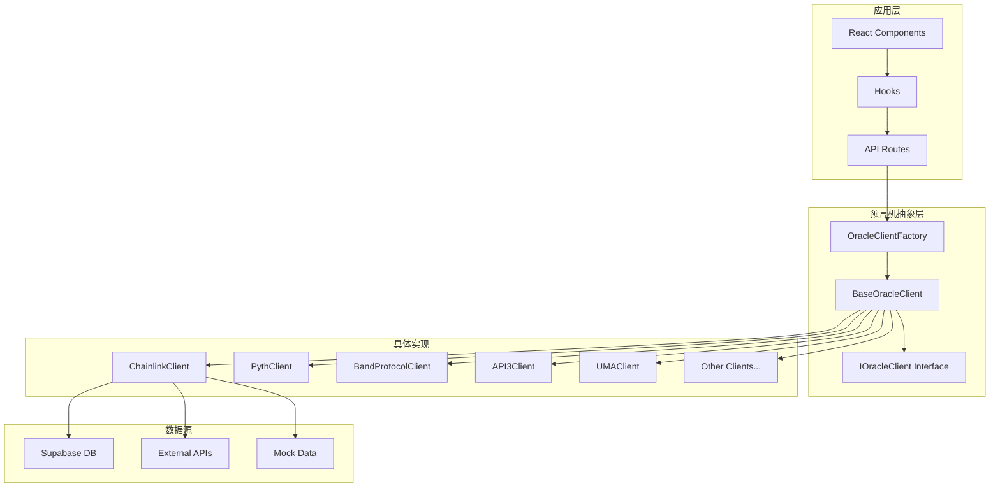
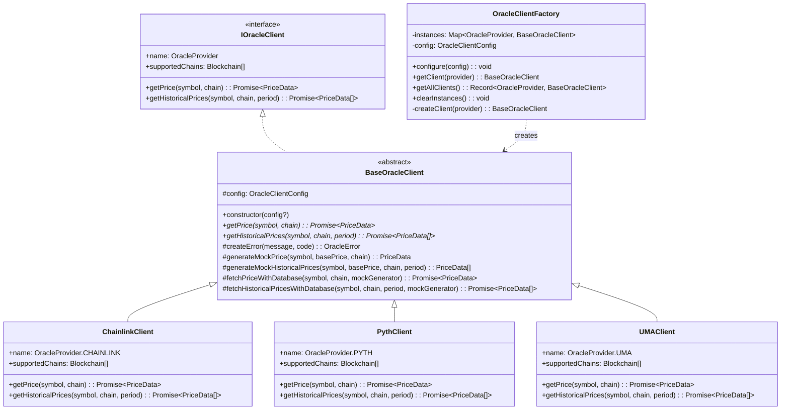
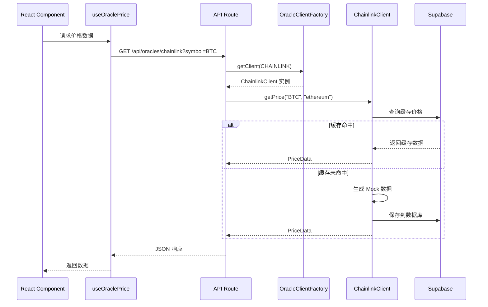

# 预言机系统架构

> Insight 平台的多预言机集成架构设计

## 目录

- [系统概览](#系统概览)
- [架构图](#架构图)
- [核心组件](#核心组件)
- [数据流](#数据流)
- [扩展指南](#扩展指南)

## 系统概览

Insight 平台支持多种区块链预言机提供商，采用统一的抽象层设计，使得不同预言机的集成变得简单且一致。

### 支持的预言机

| 预言机 | 标识符 | 主要链 | 特点 |
|--------|--------|--------|------|
| Chainlink | `chainlink` | Ethereum, Arbitrum, Polygon | 市场领导者 |
| Pyth Network | `pyth` | Solana, Ethereum | 低延迟金融数据 |
| Band Protocol | `band_protocol` | Cosmos, Ethereum | 跨链数据 |
| API3 | `api3` | Ethereum, Polygon | 第一方预言机 |
| UMA | `uma` | Ethereum | 乐观预言机 |
| RedStone | `redstone` | Arbitrum, Ethereum | 高效数据推送 |
| DIA | `dia` | 多链 | 透明数据源 |
| Tellor | `tellor` | Ethereum | 去中心化报告 |
| Chronicle | `chronicle` | Ethereum | MakerDAO 生态 |
| WINkLink | `winklink` | Tron | 波场生态 |

## 架构图

### 整体架构



### 类层次结构



## 核心组件

### 1. BaseOracleClient (抽象基类)

`BaseOracleClient` 是所有预言机客户端的抽象基类，定义了统一的接口和通用功能。

```typescript
// src/lib/oracles/base.ts
export abstract class BaseOracleClient {
  abstract name: OracleProvider;
  abstract supportedChains: Blockchain[];
  abstract getPrice(symbol: string, chain?: Blockchain): Promise<PriceData>;
  abstract getHistoricalPrices(
    symbol: string,
    chain?: Blockchain,
    period?: number
  ): Promise<PriceData[]>;

  protected config: OracleClientConfig;

  constructor(config?: OracleClientConfig) {
    this.config = { ...DEFAULT_CLIENT_CONFIG, ...config };
  }

  // 通用错误创建方法
  protected createError(message: string, code?: string): OracleError {
    return {
      message,
      provider: this.name,
      code,
    };
  }

  // Mock 数据生成（用于开发和测试）
  protected generateMockPrice(
    symbol: string,
    basePrice: number,
    chain?: Blockchain,
    timestamp?: number
  ): PriceData {
    // 实现细节...
  }

  // 带数据库缓存的数据获取
  protected async fetchPriceWithDatabase(
    symbol: string,
    chain: Blockchain | undefined,
    mockGenerator: () => PriceData
  ): Promise<PriceData> {
    // 先查数据库，再生成 Mock
    // 实现细节...
  }
}
```

**关键特性：**

- **抽象方法**：`getPrice` 和 `getHistoricalPrices` 必须由子类实现
- **Mock 数据生成**：提供基于随机游走模型的价格数据生成
- **数据库集成**：自动缓存和读取数据库中的价格数据
- **链特定波动率**：不同区块链有不同的价格波动率配置

### 2. OracleClientFactory (工厂模式)

工厂模式用于创建和管理预言机客户端实例，支持依赖注入和单例模式。

```typescript
// src/lib/oracles/factory.ts
export class OracleClientFactory {
  private static instances: Map<OracleProvider, BaseOracleClient> = new Map();
  private static config: OracleClientConfig = {
    useDatabase: true,
    fallbackToMock: true,
  };

  static configure(config: Partial<OracleClientConfig>): void {
    this.config = { ...this.config, ...config };
  }

  static getClient(provider: OracleProvider): BaseOracleClient {
    // 支持依赖注入
    if (container.has(SERVICE_TOKENS.ORACLE_CLIENT_FACTORY)) {
      const factory = container.resolve<IOracleClientFactory>(
        SERVICE_TOKENS.ORACLE_CLIENT_FACTORY
      );
      const client = factory.getClient(provider);
      if (client instanceof BaseOracleClient) {
        return client;
      }
    }

    // 单例模式
    if (!this.instances.has(provider)) {
      this.instances.set(provider, this.createClient(provider));
    }
    return this.instances.get(provider)!;
  }

  static getAllClients(): Record<OracleProvider, BaseOracleClient> {
    const providers = [
      OracleProvider.CHAINLINK,
      OracleProvider.BAND_PROTOCOL,
      OracleProvider.UMA,
      OracleProvider.PYTH,
      OracleProvider.API3,
      OracleProvider.REDSTONE,
      OracleProvider.DIA,
      OracleProvider.TELLOR,
      OracleProvider.CHRONICLE,
      OracleProvider.WINKLINK,
    ];

    const clients: Partial<Record<OracleProvider, BaseOracleClient>> = {};
    providers.forEach((provider) => {
      clients[provider] = this.getClient(provider);
    });

    return clients as Record<OracleProvider, BaseOracleClient>;
  }

  private static createClient(provider: OracleProvider): BaseOracleClient {
    switch (provider) {
      case OracleProvider.CHAINLINK:
        return new ChainlinkClient(this.config);
      case OracleProvider.BAND_PROTOCOL:
        return new BandProtocolClient(this.config);
      case OracleProvider.UMA:
        return new UMAClient(this.config);
      // ... 其他预言机
      default:
        throw new ValidationError(`Unknown oracle provider: ${provider}`);
    }
  }
}
```

**设计优势：**

- **单例管理**：每个预言机只有一个实例，节省资源
- **延迟初始化**：首次使用时才创建实例
- **依赖注入支持**：可通过 DI 容器替换实现
- **统一配置**：所有客户端共享配置

### 3. 接口定义

```typescript
// src/lib/oracles/interfaces.ts
export interface IOracleClient {
  readonly name: OracleProvider;
  readonly supportedChains: Blockchain[];
  getPrice(symbol: string, chain?: Blockchain): Promise<PriceData>;
  getHistoricalPrices(
    symbol: string,
    chain?: Blockchain,
    period?: number
  ): Promise<PriceData[]>;
}

export interface IOracleClientFactory {
  getClient(provider: OracleProvider): IOracleClient;
  getAllClients(): Record<OracleProvider, IOracleClient>;
  hasClient(provider: OracleProvider): boolean;
  clearInstances(): void;
}

export interface IMockOracleClient extends IOracleClient {
  setMockPrice(symbol: string, price: PriceData): void;
  setMockHistoricalPrices(symbol: string, prices: PriceData[]): void;
  setMockError(symbol: string, error: OracleError): void;
  clearMocks(): void;
  getCallHistory(): MockCallHistory[];
}
```

### 4. 具体实现示例：ChainlinkClient

```typescript
// src/lib/oracles/chainlink.ts
export class ChainlinkClient extends BaseOracleClient {
  name = OracleProvider.CHAINLINK;
  supportedChains = [
    Blockchain.ETHEREUM,
    Blockchain.ARBITRUM,
    Blockchain.POLYGON,
    Blockchain.AVALANCHE,
    Blockchain.BNB_CHAIN,
    Blockchain.OPTIMISM,
    Blockchain.BASE,
  ];

  async getPrice(
    symbol: string,
    chain: Blockchain = Blockchain.ETHEREUM
  ): Promise<PriceData> {
    return this.fetchPriceWithDatabase(
      symbol,
      chain,
      () => {
        const basePrice = this.getBasePrice(symbol);
        return this.generateMockPrice(symbol, basePrice, chain);
      }
    );
  }

  async getHistoricalPrices(
    symbol: string,
    chain: Blockchain = Blockchain.ETHEREUM,
    period: number = 24
  ): Promise<PriceData[]> {
    return this.fetchHistoricalPricesWithDatabase(
      symbol,
      chain,
      period,
      () => {
        const basePrice = this.getBasePrice(symbol);
        return this.generateMockHistoricalPrices(symbol, basePrice, chain, period);
      }
    );
  }

  private getBasePrice(symbol: string): number {
    const prices: Record<string, number> = {
      BTC: 45000,
      ETH: 3000,
      LINK: 15,
      // ...
    };
    return prices[symbol] || 100;
  }
}
```

## 数据流

### 价格数据获取流程



### 数据存储策略

```typescript
// src/lib/oracles/storage.ts
export interface OracleStorageConfig {
  useDatabase: boolean;
  cacheDuration: number; // 毫秒
}

export async function getPriceFromDatabase(
  provider: OracleProvider,
  symbol: string,
  chain?: Blockchain
): Promise<PriceData | null> {
  const { data, error } = await supabase
    .from('oracle_prices')
    .select('*')
    .eq('provider', provider)
    .eq('symbol', symbol)
    .eq('chain', chain || 'ethereum')
    .gt('timestamp', Date.now() - CACHE_DURATION)
    .single();

  if (error || !data) return null;
  return transformDatabaseRecord(data);
}

export async function savePriceToDatabase(price: PriceData): Promise<void> {
  await supabase.from('oracle_prices').upsert({
    provider: price.provider,
    symbol: price.symbol,
    chain: price.chain || 'ethereum',
    price: price.price,
    timestamp: price.timestamp,
    confidence: price.confidence,
    change_24h: price.change24h,
    change_24h_percent: price.change24hPercent,
  });
}
```

## 扩展指南

### 添加新的预言机支持

#### 步骤 1：创建客户端类

```typescript
// src/lib/oracles/newOracle.ts
import { BaseOracleClient } from './base';
import { OracleProvider, Blockchain } from '@/types/oracle';
import type { PriceData } from '@/types/oracle';

export class NewOracleClient extends BaseOracleClient {
  name = OracleProvider.NEW_ORACLE;
  supportedChains = [
    Blockchain.ETHEREUM,
    Blockchain.POLYGON,
    // 添加支持的链
  ];

  async getPrice(
    symbol: string,
    chain?: Blockchain
  ): Promise<PriceData> {
    return this.fetchPriceWithDatabase(
      symbol,
      chain,
      () => {
        // 实现实际的价格获取逻辑
        // 或调用 generateMockPrice 生成模拟数据
        const basePrice = this.getBasePrice(symbol);
        return this.generateMockPrice(symbol, basePrice, chain);
      }
    );
  }

  async getHistoricalPrices(
    symbol: string,
    chain?: Blockchain,
    period: number = 24
  ): Promise<PriceData[]> {
    return this.fetchHistoricalPricesWithDatabase(
      symbol,
      chain,
      period,
      () => {
        const basePrice = this.getBasePrice(symbol);
        return this.generateMockHistoricalPrices(symbol, basePrice, chain, period);
      }
    );
  }

  private getBasePrice(symbol: string): number {
    // 定义基础价格
    const prices: Record<string, number> = {
      BTC: 45000,
      ETH: 3000,
    };
    return prices[symbol] || 100;
  }
}
```

#### 步骤 2：更新工厂

```typescript
// src/lib/oracles/factory.ts
import { NewOracleClient } from './newOracle';

private static createClient(provider: OracleProvider): BaseOracleClient {
  switch (provider) {
    // ... 现有 case
    case OracleProvider.NEW_ORACLE:
      return new NewOracleClient(this.config);
    // ...
  }
}
```

#### 步骤 3：更新枚举和类型

```typescript
// src/types/oracle.ts
export const enum OracleProvider {
  // ... 现有值
  NEW_ORACLE = 'new_oracle',
}
```

#### 步骤 4：添加颜色配置

```typescript
// src/lib/oracles/colors.ts
export const ORACLE_COLORS: Record<OracleProvider, OracleColorScheme> = {
  // ... 现有配置
  [OracleProvider.NEW_ORACLE]: {
    primary: '#FF6B6B',
    secondary: '#FF8787',
    light: '#FFF5F5',
    dark: '#C92A2A',
    gradient: ['#FF6B6B', '#FF8787'],
  },
};
```

#### 步骤 5：创建页面组件

```typescript
// src/app/[locale]/new-oracle/page.tsx
import { OraclePageTemplate } from '@/components/oracle/shared';
import { OracleProvider } from '@/types/oracle';

export default function NewOraclePage() {
  return (
    <OraclePageTemplate
      provider={OracleProvider.NEW_ORACLE}
      title="New Oracle"
      description="Description of the new oracle"
    />
  );
}
```

### 最佳实践

1. **始终继承 BaseOracleClient**：确保接口一致性
2. **使用数据库缓存**：通过 `fetchPriceWithDatabase` 方法
3. **定义基础价格**：为常用资产提供合理的基准价格
4. **支持多链**：明确定义 `supportedChains`
5. **添加测试**：为新客户端编写单元测试
6. **文档化**：更新相关文档和类型定义

### 测试新预言机

```typescript
// src/lib/oracles/__tests__/newOracle.test.ts
import { NewOracleClient } from '../newOracle';
import { OracleProvider, Blockchain } from '@/types/oracle';

describe('NewOracleClient', () => {
  let client: NewOracleClient;

  beforeEach(() => {
    client = new NewOracleClient();
  });

  it('should have correct name', () => {
    expect(client.name).toBe(OracleProvider.NEW_ORACLE);
  });

  it('should support expected chains', () => {
    expect(client.supportedChains).toContain(Blockchain.ETHEREUM);
    expect(client.supportedChains).toContain(Blockchain.POLYGON);
  });

  it('should fetch price for BTC', async () => {
    const price = await client.getPrice('BTC', Blockchain.ETHEREUM);
    expect(price.symbol).toBe('BTC');
    expect(price.provider).toBe(OracleProvider.NEW_ORACLE);
    expect(price.price).toBeGreaterThan(0);
    expect(price.timestamp).toBeGreaterThan(0);
  });

  it('should fetch historical prices', async () => {
    const prices = await client.getHistoricalPrices('ETH', Blockchain.ETHEREUM, 24);
    expect(prices).toHaveLength(96); // 24 hours * 4 data points per hour
    expect(prices[0].symbol).toBe('ETH');
  });
});
```

## 性能优化

### 1. 连接池

工厂模式确保每个预言机只有一个实例，避免重复创建连接。

### 2. 数据缓存

- **数据库缓存**：自动缓存价格数据到 Supabase
- **React Query 缓存**：前端数据缓存和重新验证
- **内存缓存**：考虑添加 Redis 层

### 3. 批量获取

```typescript
// 批量获取多个资产的价格
async function getMultiplePrices(
  provider: OracleProvider,
  symbols: string[]
): Promise<PriceData[]> {
  const client = OracleClientFactory.getClient(provider);
  const promises = symbols.map((symbol) =>
    client.getPrice(symbol).catch((error) => {
      console.error(`Failed to fetch ${symbol}:`, error);
      return null;
    })
  );
  const results = await Promise.all(promises);
  return results.filter((price): price is PriceData => price !== null);
}
```

## 故障处理

### 错误类型

```typescript
// src/lib/errors/index.ts
export class PriceFetchError extends AppError {
  constructor(
    message: string,
    details: {
      provider: OracleProvider;
      symbol: string;
      chain?: Blockchain;
      retryable: boolean;
    },
    cause?: Error
  ) {
    super({
      message,
      code: 'PRICE_FETCH_ERROR',
      statusCode: 502,
      details,
      cause,
    });
  }
}
```

### 重试策略

```typescript
// React Query 配置
const queryClient = new QueryClient({
  defaultOptions: {
    queries: {
      retry: 3,
      retryDelay: (attempt) => Math.min(1000 * 2 ** attempt, 30000),
    },
  },
});
```
