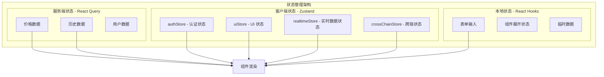
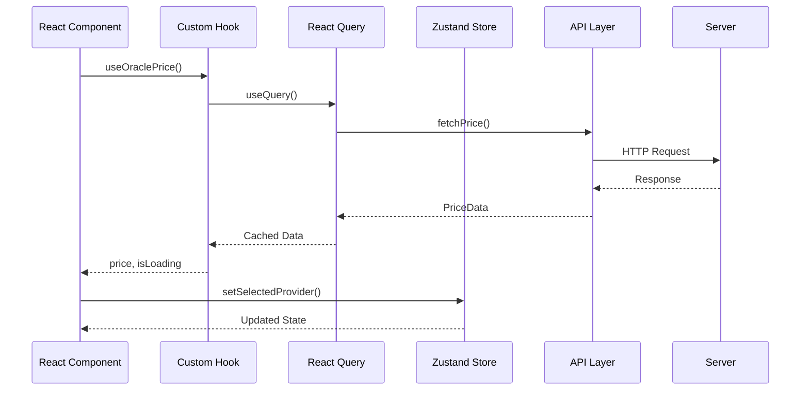

# 状态管理架构

> Insight 平台的状态管理策略与最佳实践

## 目录

- [概述](#概述)
- [状态分层](#状态分层)
- [React Query](#react-query)
- [Zustand Store](#zustand-store)
- [最佳实践](#最佳实践)

## 概述

Insight 采用分层状态管理策略：

- **服务端状态**：React Query - 处理服务器数据缓存和同步
- **客户端状态**：Zustand - 管理 UI 状态和全局应用状态
- **本地状态**：React useState/useReducer - 组件级状态



## Zustand Stores

Insight 包含以下四个 Zustand Store：

| Store           | 文件位置                        | 用途             |
| --------------- | ------------------------------- | ---------------- |
| authStore       | `src/stores/authStore.ts`       | 用户认证状态管理 |
| uiStore         | `src/stores/uiStore.ts`         | UI 状态管理      |
| realtimeStore   | `src/stores/realtimeStore.ts`   | 实时数据状态管理 |
| crossChainStore | `src/stores/crossChainStore.ts` | 跨链数据状态管理 |

## authStore

认证状态管理，处理用户登录、注册、OAuth 认证等。

```typescript
// src/stores/authStore.ts
interface AuthState {
  user: User | null;
  session: Session | null;
  profile: UserProfile | null;
  loading: boolean;
  error: AuthError | Error | null;
  initialized: boolean;
  subscription: Subscription | null;
}

interface AuthActions {
  initialize: () => Promise<void>;
  cleanup: () => void;
  signUp: (
    email: string,
    password: string,
    displayName?: string
  ) => Promise<{ error: AuthError | null }>;
  signIn: (email: string, password: string) => Promise<{ error: AuthError | null }>;
  signInWithOAuth: (provider: Provider) => Promise<{ error: AuthError | null }>;
  signOut: () => Promise<{ error: AuthError | null }>;
  resetPassword: (email: string) => Promise<{ error: AuthError | null }>;
  refreshProfile: () => Promise<void>;
  setUser: (user: User | null) => void;
  setSession: (session: Session | null) => void;
  setProfile: (profile: UserProfile | null) => void;
  setLoading: (loading: boolean) => void;
  setError: (error: AuthError | Error | null) => void;
  clearError: () => void;
}
```

**导出的 Hooks：**

```typescript
export const useUser = () => useAuthStore((state) => state.user);
export const useSession = () => useAuthStore((state) => state.session);
export const useProfile = () => useAuthStore((state) => state.profile);
export const useAuthLoading = () => useAuthStore((state) => state.loading);
export const useAuthError = () => useAuthStore((state) => state.error);
export const useAuthInitialized = () => useAuthStore((state) => state.initialized);
export const useIsAuthenticated = () => useAuthStore((state) => !!state.user);
export const useAuthActions = () => {
  const initialize = useAuthStore((state) => state.initialize);
  const cleanup = useAuthStore((state) => state.cleanup);
  const signUp = useAuthStore((state) => state.signUp);
  const signIn = useAuthStore((state) => state.signIn);
  const signInWithOAuth = useAuthStore((state) => state.signInWithOAuth);
  const signOut = useAuthStore((state) => state.signOut);
  const resetPassword = useAuthStore((state) => state.resetPassword);
  const refreshProfile = useAuthStore((state) => state.refreshProfile);
  const clearError = useAuthStore((state) => state.clearError);

  return useMemo(
    () => ({
      initialize,
      cleanup,
      signUp,
      signIn,
      signInWithOAuth,
      signOut,
      resetPassword,
      refreshProfile,
      clearError,
    }),
    [
      initialize,
      cleanup,
      signUp,
      signIn,
      signInWithOAuth,
      signOut,
      resetPassword,
      refreshProfile,
      clearError,
    ]
  );
};
```

## uiStore

UI 状态管理，处理侧边栏、模态框、Toast 通知、主题等。

```typescript
// src/stores/uiStore.ts
interface UIState {
  sidebarOpen: boolean;
  sidebarCollapsed: boolean;
  activeModal: string | null;
  modalData: Record<string, unknown> | null;
  toasts: Toast[];
  theme: 'light' | 'dark' | 'system';
}

interface Toast {
  id: string;
  type: 'success' | 'error' | 'warning' | 'info';
  message: string;
  duration?: number;
}

interface UIActions {
  toggleSidebar: () => void;
  setSidebarCollapsed: (collapsed: boolean) => void;
  openModal: (modalId: string, data?: Record<string, unknown>) => void;
  closeModal: () => void;
  addToast: (toast: Omit<Toast, 'id'>) => void;
  removeToast: (id: string) => void;
  setTheme: (theme: 'light' | 'dark' | 'system') => void;
}
```

**主要功能：**

- **Sidebar 管理**：`toggleSidebar`、`setSidebarCollapsed`
- **Modal 管理**：`openModal`、`closeModal`
- **Toast 通知**：`addToast`、`removeToast`（自动 5 秒后移除）
- **主题切换**：`setTheme`

## realtimeStore

实时数据状态管理，处理 Supabase Realtime 连接和订阅。

```typescript
// src/stores/realtimeStore.ts
interface RealtimeState {
  connectionStatus: ConnectionStatus;
  activeSubscriptions: string[];
  lastPriceUpdate: PriceUpdatePayload | null;
  lastAlertEvent: AlertEventPayload | null;
  lastSnapshotChange: SnapshotChangePayload | null;
  lastFavoriteChange: FavoriteChangePayload | null;
  priceUpdateCount: number;
  alertEventCount: number;
  reconnectAttempts: number;
  userId: string | null;
  _initialized: boolean;
}

interface RealtimeActions {
  setConnectionStatus: (status: ConnectionStatus) => void;
  setActiveSubscriptions: (subscriptions: string[]) => void;
  subscribeToPriceUpdates: (
    callback?: (payload: PriceUpdatePayload) => void,
    filters?: { provider?: string; symbol?: string; chain?: string }
  ) => () => void;
  subscribeToAlertEvents: (
    userId: string,
    callback?: (payload: AlertEventPayload) => void
  ) => () => void;
  subscribeToSnapshotChanges: (
    userId: string,
    callback?: (payload: SnapshotChangePayload) => void
  ) => () => void;
  subscribeToFavoriteChanges: (
    userId: string,
    callback?: (payload: FavoriteChangePayload) => void
  ) => () => void;
  reconnect: () => void;
  reset: () => void;
  _initialize: () => void;
  setUserId: (userId: string | null) => void;
}
```

**导出的 Hooks：**

```typescript
export const useConnectionStatus = () => useRealtimeStore((state) => state.connectionStatus);
export const useActiveSubscriptions = () => useRealtimeStore((state) => state.activeSubscriptions);
export const useLastPriceUpdate = () => useRealtimeStore((state) => state.lastPriceUpdate);
export const useLastAlertEvent = () => useRealtimeStore((state) => state.lastAlertEvent);
export const useLastSnapshotChange = () => useRealtimeStore((state) => state.lastSnapshotChange);
export const useLastFavoriteChange = () => useRealtimeStore((state) => state.lastFavoriteChange);
export const usePriceUpdateCount = () => useRealtimeStore((state) => state.priceUpdateCount);
export const useAlertEventCount = () => useRealtimeStore((state) => state.alertEventCount);
export const useReconnectAttempts = () => useRealtimeStore((state) => state.reconnectAttempts);
export const useIsConnected = () =>
  useRealtimeStore((state) => state.connectionStatus === 'connected');
export const useRealtimeActions = () =>
  useRealtimeStore(
    useShallow((state) => ({
      setConnectionStatus: state.setConnectionStatus,
      setActiveSubscriptions: state.setActiveSubscriptions,
      subscribeToPriceUpdates: state.subscribeToPriceUpdates,
      subscribeToAlertEvents: state.subscribeToAlertEvents,
      subscribeToSnapshotChanges: state.subscribeToSnapshotChanges,
      subscribeToFavoriteChanges: state.subscribeToFavoriteChanges,
      reconnect: state.reconnect,
      reset: state.reset,
      _initialize: state._initialize,
      setUserId: state.setUserId,
    }))
  );
```

**支持的实时订阅：**

- `subscribeToPriceUpdates` - 价格更新
- `subscribeToAlertEvents` - 警报事件
- `subscribeToSnapshotChanges` - 快照变化
- `subscribeToFavoriteChanges` - 收藏变化

## crossChainStore

跨链数据状态管理，处理预言机、符号、链、时间范围等状态。

```typescript
// src/stores/crossChainStore.ts
import { type RefreshInterval } from '@/app/[locale]/cross-chain/constants';
import { type ThresholdConfig } from '@/app/[locale]/cross-chain/utils';

interface SelectorState {
  selectedProvider: OracleProvider;
  selectedSymbol: string;
  selectedTimeRange: number;
  selectedBaseChain: Blockchain | null;
}

interface UIState {
  visibleChains: Blockchain[];
  showMA: boolean;
  maPeriod: number;
  chartKey: number;
  hiddenLines: Set<string>;
  focusedChain: Blockchain | null;
  tableFilter: 'all' | 'abnormal' | 'normal';
  hoveredCell: { xChain: Blockchain; yChain: Blockchain; x: number; y: number } | null;
  selectedCell: { xChain: Blockchain; yChain: Blockchain } | null;
  tooltipPosition: { x: number; y: number };
  sortColumn: string;
  sortDirection: 'asc' | 'desc';
}

interface DataState {
  currentPrices: PriceData[];
  historicalPrices: Partial<Record<Blockchain, PriceData[]>>;
  loading: boolean;
  refreshStatus: 'idle' | 'refreshing' | 'success' | 'error';
  showRefreshSuccess: boolean;
  lastUpdated: Date | null;
  prevStats: {
    avgPrice: number;
    maxPrice: number;
    minPrice: number;
    priceRange: number;
    standardDeviationPercent: number;
  } | null;
  recommendedBaseChain: Blockchain | null;
}

interface ConfigState {
  refreshInterval: RefreshInterval;
  thresholdConfig: ThresholdConfig;
  colorblindMode: boolean;
  updateIntervals: Partial<Record<Blockchain, number>>;
}

interface CrossChainStore extends SelectorState, UIState, DataState, ConfigState {
  // Selectors Actions
  setSelectedProvider: (provider: OracleProvider) => void;
  setSelectedSymbol: (symbol: string) => void;
  setSelectedTimeRange: (range: number) => void;
  setSelectedBaseChain: (chain: Blockchain | null) => void;

  // UI Actions
  setVisibleChains: (chains: Blockchain[]) => void;
  setShowMA: (show: boolean) => void;
  setMaPeriod: (period: number) => void;
  setChartKey: (key: number) => void;
  setHiddenLines: (lines: Set<string>) => void;
  setFocusedChain: (chain: Blockchain | null) => void;
  setTableFilter: (filter: 'all' | 'abnormal' | 'normal') => void;
  setHoveredCell: (
    cell: { xChain: Blockchain; yChain: Blockchain; x: number; y: number } | null
  ) => void;
  setSelectedCell: (cell: { xChain: Blockchain; yChain: Blockchain } | null) => void;
  setTooltipPosition: (position: { x: number; y: number }) => void;
  setSortColumn: (column: string) => void;
  setSortDirection: (direction: 'asc' | 'desc') => void;

  // Data Actions
  setCurrentPrices: (prices: PriceData[]) => void;
  setHistoricalPrices: (prices: Partial<Record<Blockchain, PriceData[]>>) => void;
  setLoading: (loading: boolean) => void;
  setRefreshStatus: (status: 'idle' | 'refreshing' | 'success' | 'error') => void;
  setShowRefreshSuccess: (show: boolean) => void;
  setLastUpdated: (date: Date | null) => void;
  setPrevStats: (stats: DataState['prevStats']) => void;
  setRecommendedBaseChain: (chain: Blockchain | null) => void;

  // Config Actions
  setRefreshInterval: (interval: RefreshInterval) => void;
  setThresholdConfig: (config: ThresholdConfig) => void;
  setColorblindMode: (enabled: boolean) => void;
  setUpdateIntervals: (intervals: Partial<Record<Blockchain, number>>) => void;

  // Utility Actions
  toggleChain: (chain: Blockchain) => void;
  handleSort: (column: string) => void;
}

const initialState: SelectorState & UIState & DataState & ConfigState = {
  selectedProvider: OracleProvider.CHAINLINK,
  selectedSymbol: 'BTC',
  selectedTimeRange: 24,
  selectedBaseChain: null,

  visibleChains: [],
  showMA: false,
  maPeriod: 7,
  chartKey: 0,
  hiddenLines: new Set(),
  focusedChain: null,
  tableFilter: 'all',
  hoveredCell: null,
  selectedCell: null,
  tooltipPosition: { x: 0, y: 0 },
  sortColumn: 'chain',
  sortDirection: 'asc',

  currentPrices: [],
  historicalPrices: {},
  loading: true,
  refreshStatus: 'idle',
  showRefreshSuccess: false,
  lastUpdated: null,
  prevStats: null,
  recommendedBaseChain: null,

  refreshInterval: 0,
  thresholdConfig: defaultThresholdConfig,
  colorblindMode: false,
  updateIntervals: {},
};
```

**使用 Immer 中间件和持久化：**

```typescript
export const useCrossChainStore = create<CrossChainStore>()(
  devtools(
    persist(
      (set, get) => ({
        ...initialState,

        setSelectedProvider: (provider) => set({ selectedProvider: provider }),
        setSelectedSymbol: (symbol) => set({ selectedSymbol: symbol }),
        setSelectedTimeRange: (range) => set({ selectedTimeRange: range }),
        setSelectedBaseChain: (chain) => set({ selectedBaseChain: chain }),

        setVisibleChains: (chains) => set({ visibleChains: chains }),
        setShowMA: (show) => set({ showMA: show }),
        setMaPeriod: (period) => set({ maPeriod: period }),
        setChartKey: (key) => set({ chartKey: key }),
        setHiddenLines: (lines) => set({ hiddenLines: lines }),
        setFocusedChain: (chain) => set({ focusedChain: chain }),
        setTableFilter: (filter) => set({ tableFilter: filter }),
        setHoveredCell: (cell) => set({ hoveredCell: cell }),
        setSelectedCell: (cell) => set({ selectedCell: cell }),
        setTooltipPosition: (position) => set({ tooltipPosition: position }),
        setSortColumn: (column) => set({ sortColumn: column }),
        setSortDirection: (direction) => set({ sortDirection: direction }),

        setCurrentPrices: (prices) => set({ currentPrices: prices }),
        setHistoricalPrices: (prices) => set({ historicalPrices: prices }),
        setLoading: (loading) => set({ loading }),
        setRefreshStatus: (status) => set({ refreshStatus: status }),
        setShowRefreshSuccess: (show) => set({ showRefreshSuccess: show }),
        setLastUpdated: (date) => set({ lastUpdated: date }),
        setPrevStats: (stats) => set({ prevStats: stats }),
        setRecommendedBaseChain: (chain) => set({ recommendedBaseChain: chain }),

        setRefreshInterval: (interval) => set({ refreshInterval: interval }),
        setThresholdConfig: (config) => set({ thresholdConfig: config }),
        setColorblindMode: (enabled) => set({ colorblindMode: enabled }),
        setUpdateIntervals: (intervals) => set({ updateIntervals: intervals }),

        toggleChain: (chain) => {
          const { visibleChains } = get();
          if (visibleChains.includes(chain)) {
            set({ visibleChains: visibleChains.filter((c) => c !== chain) });
          } else {
            set({ visibleChains: [...visibleChains, chain] });
          }
        },

        handleSort: (column) => {
          const { sortColumn, sortDirection } = get();
          if (sortColumn === column) {
            set({ sortDirection: sortDirection === 'asc' ? 'desc' : 'asc' });
          } else {
            set({ sortColumn: column, sortDirection: 'asc' });
          }
        },
      }),
      {
        name: 'cross-chain-store',
        storage: createJSONStorage(() => localStorage),
        partialize: (state) => ({
          selectedProvider: state.selectedProvider,
          selectedSymbol: state.selectedSymbol,
          selectedTimeRange: state.selectedTimeRange,
          refreshInterval: state.refreshInterval,
          thresholdConfig: state.thresholdConfig,
          colorblindMode: state.colorblindMode,
          showMA: state.showMA,
          maPeriod: state.maPeriod,
          tableFilter: state.tableFilter,
          sortColumn: state.sortColumn,
          sortDirection: state.sortDirection,
        }),
      }
    ),
    { name: 'CrossChainStore' }
  )
);
```

## 选择器模式

```typescript
// src/stores/selectors.ts
import { useCrossChainStore } from './crossChainStore';

export const useSelectedProvider = () => useCrossChainStore((state) => state.selectedProvider);

export const useVisibleChains = () => useCrossChainStore((state) => state.visibleChains);

export const useIsChainVisible = (chain: Blockchain) =>
  useCrossChainStore((state) => state.visibleChains.includes(chain));

export const useCrossChainActions = () =>
  useCrossChainStore((state) => ({
    setSelectedProvider: state.setSelectedProvider,
    setSelectedSymbol: state.setSelectedSymbol,
    toggleChain: state.toggleChain,
    reset: state.reset,
  }));
```

## 状态分层

### 分层策略

| 层级           | 工具        | 用途                     | 持久化       |
| -------------- | ----------- | ------------------------ | ------------ |
| 服务端状态     | React Query | API 数据、缓存、同步     | 自动缓存     |
| 全局客户端状态 | Zustand     | 用户偏好、主题、全局设置 | localStorage |
| 局部客户端状态 | Zustand     | 页面级状态、临时数据     | 内存         |
| 组件状态       | useState    | 表单、UI 交互            | 无           |

### 状态流



## React Query

### Query Keys 管理

```typescript
// src/lib/queries/queryKeys.ts
export const queryKeys = {
  oracles: {
    all: ['oracles'] as const,
    detail: (provider: OracleProvider) => ['oracles', provider] as const,
    price: (provider: OracleProvider, symbol: string, chain?: Blockchain) =>
      ['oracles', provider, 'price', symbol, chain] as const,
    history: (provider: OracleProvider, symbol: string, period: number) =>
      ['oracles', provider, 'history', symbol, period] as const,
    comparison: (symbols: string[]) => ['oracles', 'comparison', ...symbols] as const,
  },
  alerts: {
    all: ['alerts'] as const,
    detail: (id: string) => ['alerts', id] as const,
    events: ['alertEvents'] as const,
    stats: ['alertStats'] as const,
  },
  user: {
    profile: ['user', 'profile'] as const,
    preferences: ['user', 'preferences'] as const,
    favorites: ['user', 'favorites'] as const,
  },
  market: {
    overview: ['market', 'overview'] as const,
    trends: ['market', 'trends'] as const,
  },
} as const;
```

### Query Hooks

```typescript
// src/hooks/queries/useOraclePrices.ts
export function useOraclePrice(provider: OracleProvider, symbol: string, chain?: Blockchain) {
  return useQuery({
    queryKey: queryKeys.oracles.price(provider, symbol, chain),
    queryFn: async () => {
      const client = OracleClientFactory.getClient(provider);
      return client.getPrice(symbol, chain);
    },
    staleTime: 30 * 1000,
    gcTime: 5 * 60 * 1000,
    retry: 3,
    retryDelay: (attempt) => Math.min(1000 * 2 ** attempt, 30000),
    refetchOnWindowFocus: false,
  });
}

export function usePriceHistory(
  provider: OracleProvider,
  symbol: string,
  chain?: Blockchain,
  period: number = 24
) {
  return useQuery({
    queryKey: queryKeys.oracles.history(provider, symbol, period),
    queryFn: async () => {
      const client = OracleClientFactory.getClient(provider);
      return client.getHistoricalPrices(symbol, chain, period);
    },
    staleTime: 5 * 60 * 1000,
    gcTime: 30 * 60 * 1000,
  });
}
```

## 最佳实践

### 1. 状态分离原则

```typescript
// ❌ 不好的做法：混合服务端和客户端状态
function BadComponent() {
  const [prices, setPrices] = useState([]);
  const [loading, setLoading] = useState(false);

  useEffect(() => {
    setLoading(true);
    fetchPrices().then((data) => {
      setPrices(data);
      setLoading(false);
    });
  }, []);
}

// ✅ 好的做法：使用 React Query 处理服务端状态
function GoodComponent() {
  const { data: prices, isLoading } = useOraclePrices();
}
```

### 2. 使用 Immer 进行不可变更新

```typescript
// ✅ 使用 Immer 进行不可变更新
set((state) => {
  state.nested.object.value = newValue;
});

// ❌ 避免手动展开
set((state) => ({
  ...state,
  nested: {
    ...state.nested,
    object: {
      ...state.nested.object,
      value: newValue,
    },
  },
}));
```

### 3. 使用细粒度订阅

```typescript
// ✅ 只订阅需要的字段
const price = useCrossChainStore((state) => state.price);

// ❌ 避免订阅整个 Store
const state = useCrossChainStore();
```

### 4. 乐观更新模式

```typescript
const useUpdatePreference = () => {
  const queryClient = useQueryClient();

  return useMutation({
    mutationFn: updatePreferenceAPI,
    onMutate: async (newPreference) => {
      await queryClient.cancelQueries({ queryKey: ['preferences'] });
      const previousPreference = queryClient.getQueryData(['preferences']);
      queryClient.setQueryData(['preferences'], newPreference);
      return { previousPreference };
    },
    onError: (err, newPreference, context) => {
      queryClient.setQueryData(['preferences'], context?.previousPreference);
    },
    onSettled: () => {
      queryClient.invalidateQueries({ queryKey: ['preferences'] });
    },
  });
};
```

## 调试工具

### Zustand DevTools

```typescript
const useStore = create(
  devtools(
    (set) => ({ ... }),
    { name: 'StoreName' }
  )
);
```

### React Query DevTools

```typescript
export function ReactQueryProvider({ children }: { children: React.ReactNode }) {
  return (
    <QueryClientProvider client={queryClient}>
      {children}
      {process.env.NODE_ENV === 'development' && <ReactQueryDevtools />}
    </QueryClientProvider>
  );
}
```

## 性能优化

### 1. 查询去重

React Query 自动去重相同 Query Key 的请求。

```typescript
function ComponentA() {
  const { data } = useOraclePrice('chainlink', 'BTC');
  return <div>{data?.price}</div>;
}

function ComponentB() {
  const { data } = useOraclePrice('chainlink', 'BTC'); // 不会触发新请求
  return <div>{data?.price}</div>;
}
```

### 2. 使用 useShallow 优化选择器

```typescript
export const useRealtimeActions = () =>
  useRealtimeStore(
    useShallow((state) => ({
      setConnectionStatus: state.setConnectionStatus,
      reconnect: state.reconnect,
      // ...
    }))
  );
```

## 总结

- **服务端状态**：使用 React Query，享受缓存、重试、去重等特性
- **客户端状态**：使用 Zustand，简单、轻量、TypeScript 友好
- **状态分离**：清晰区分服务端和客户端状态，避免混合
- **四个核心 Store**：authStore、uiStore、realtimeStore、crossChainStore
- **性能优化**：使用细粒度订阅、选择器和 Immer 不可变更新
