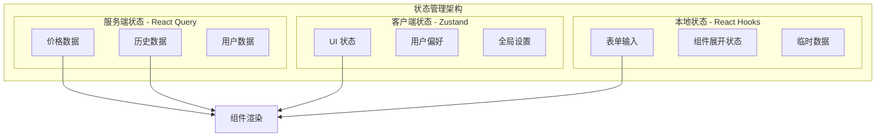
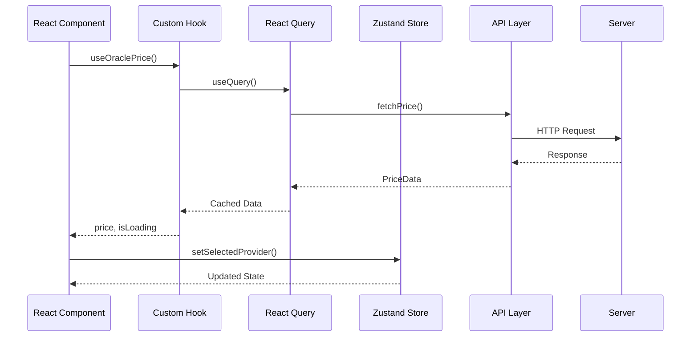

# 状态管理架构

> Insight 平台的状态管理策略与最佳实践

## 目录

- [概述](#概述)
- [状态分层](#状态分层)
- [React Query](#react-query)
- [Zustand Store](#zustand-store)
- [最佳实践](#最佳实践)

## 概述

Insight 采用分层状态管理策略：

- **服务端状态**：React Query - 处理服务器数据缓存和同步
- **客户端状态**：Zustand - 管理 UI 状态和全局应用状态
- **本地状态**：React useState/useReducer - 组件级状态



## 状态分层

### 分层策略

| 层级 | 工具 | 用途 | 持久化 |
|------|------|------|--------|
| 服务端状态 | React Query | API 数据、缓存、同步 | 自动缓存 |
| 全局客户端状态 | Zustand | 用户偏好、主题、全局设置 | localStorage |
| 局部客户端状态 | Zustand | 页面级状态、临时数据 | 内存 |
| 组件状态 | useState | 表单、UI 交互 | 无 |

### 状态流



## React Query

### Query Keys 管理

采用层级化的 Query Keys 设计，确保缓存的有效管理和精确失效。

```typescript
// src/lib/queries/queryKeys.ts
export const queryKeys = {
  oracles: {
    all: ['oracles'] as const,
    detail: (provider: OracleProvider) => ['oracles', provider] as const,
    price: (provider: OracleProvider, symbol: string, chain?: Blockchain) =>
      ['oracles', provider, 'price', symbol, chain] as const,
    history: (provider: OracleProvider, symbol: string, period: number) =>
      ['oracles', provider, 'history', symbol, period] as const,
    comparison: (symbols: string[]) =>
      ['oracles', 'comparison', ...symbols] as const,
  },
  alerts: {
    all: ['alerts'] as const,
    detail: (id: string) => ['alerts', id] as const,
    events: ['alertEvents'] as const,
    stats: ['alertStats'] as const,
  },
  user: {
    profile: ['user', 'profile'] as const,
    preferences: ['user', 'preferences'] as const,
    favorites: ['user', 'favorites'] as const,
  },
  market: {
    overview: ['market', 'overview'] as const,
    trends: ['market', 'trends'] as const,
  },
} as const;
```

### Query Hooks

```typescript
// src/hooks/queries/useOraclePrices.ts
import { useQuery, useMutation, useQueryClient } from '@tanstack/react-query';
import { queryKeys } from '@/lib/queries/queryKeys';
import { OracleClientFactory } from '@/lib/oracles/factory';
import type { PriceData } from '@/types/oracle';

// 获取单个价格
export function useOraclePrice(
  provider: OracleProvider,
  symbol: string,
  chain?: Blockchain
) {
  return useQuery({
    queryKey: queryKeys.oracles.price(provider, symbol, chain),
    queryFn: async () => {
      const client = OracleClientFactory.getClient(provider);
      return client.getPrice(symbol, chain);
    },
    staleTime: 30 * 1000, // 30 秒后数据过期
    gcTime: 5 * 60 * 1000, // 5 分钟后垃圾回收
    retry: 3,
    retryDelay: (attempt) => Math.min(1000 * 2 ** attempt, 30000),
    refetchOnWindowFocus: false,
  });
}

// 获取历史价格
export function usePriceHistory(
  provider: OracleProvider,
  symbol: string,
  chain?: Blockchain,
  period: number = 24
) {
  return useQuery({
    queryKey: queryKeys.oracles.history(provider, symbol, period),
    queryFn: async () => {
      const client = OracleClientFactory.getClient(provider);
      return client.getHistoricalPrices(symbol, chain, period);
    },
    staleTime: 5 * 60 * 1000, // 5 分钟
    gcTime: 30 * 60 * 1000, // 30 分钟
  });
}

// 获取多个价格（并行查询）
export function useMultiplePrices(
  provider: OracleProvider,
  symbols: string[],
  chain?: Blockchain
) {
  return useQueries({
    queries: symbols.map((symbol) => ({
      queryKey: queryKeys.oracles.price(provider, symbol, chain),
      queryFn: async () => {
        const client = OracleClientFactory.getClient(provider);
        return client.getPrice(symbol, chain);
      },
      staleTime: 30 * 1000,
    })),
  });
}

// 刷新价格 Mutation
export function useRefreshPrice() {
  const queryClient = useQueryClient();

  return useMutation({
    mutationFn: async ({
      provider,
      symbol,
      chain,
    }: {
      provider: OracleProvider;
      symbol: string;
      chain?: Blockchain;
    }) => {
      const client = OracleClientFactory.getClient(provider);
      return client.getPrice(symbol, chain);
    },
    onSuccess: (_, variables) => {
      // 精确失效缓存
      queryClient.invalidateQueries({
        queryKey: queryKeys.oracles.price(
          variables.provider,
          variables.symbol,
          variables.chain
        ),
      });
    },
  });
}
```

### 乐观更新

```typescript
// src/hooks/queries/useFavorites.ts
export function useToggleFavorite() {
  const queryClient = useQueryClient();
  const { user } = useAuth();

  return useMutation({
    mutationFn: async ({
      symbol,
      action,
    }: {
      symbol: string;
      action: 'add' | 'remove';
    }) => {
      const response = await fetch('/api/favorites', {
        method: action === 'add' ? 'POST' : 'DELETE',
        body: JSON.stringify({ symbol }),
      });
      return response.json();
    },
    // 乐观更新
    onMutate: async ({ symbol, action }) => {
      // 取消正在进行的重新获取
      await queryClient.cancelQueries({
        queryKey: queryKeys.user.favorites,
      });

      // 保存当前状态
      const previousFavorites = queryClient.getQueryData<string[]>(
        queryKeys.user.favorites
      );

      // 乐观更新缓存
      queryClient.setQueryData<string[]>(
        queryKeys.user.favorites,
        (old = []) => {
          if (action === 'add') {
            return [...old, symbol];
          } else {
            return old.filter((s) => s !== symbol);
          }
        }
      );

      // 返回上下文用于回滚
      return { previousFavorites };
    },
    // 错误时回滚
    onError: (err, variables, context) => {
      if (context?.previousFavorites) {
        queryClient.setQueryData(
          queryKeys.user.favorites,
          context.previousFavorites
        );
      }
    },
    // 完成后重新获取确保同步
    onSettled: () => {
      queryClient.invalidateQueries({
        queryKey: queryKeys.user.favorites,
      });
    },
  });
}
```

### 无限查询

```typescript
// src/hooks/queries/useAlertHistory.ts
export function useAlertHistory() {
  return useInfiniteQuery({
    queryKey: queryKeys.alerts.events,
    queryFn: async ({ pageParam = 0 }) => {
      const response = await fetch(`/api/alerts/events?page=${pageParam}`);
      return response.json();
    },
    getNextPageParam: (lastPage, pages) => {
      if (lastPage.hasMore) {
        return pages.length;
      }
      return undefined;
    },
    initialPageParam: 0,
  });
}
```

### 预取策略

```typescript
// src/hooks/usePrefetch.ts
export function usePrefetchOnHover() {
  const queryClient = useQueryClient();

  const prefetchPrice = useCallback(
    (provider: OracleProvider, symbol: string, chain?: Blockchain) => {
      queryClient.prefetchQuery({
        queryKey: queryKeys.oracles.price(provider, symbol, chain),
        queryFn: async () => {
          const client = OracleClientFactory.getClient(provider);
          return client.getPrice(symbol, chain);
        },
        staleTime: 60 * 1000,
      });
    },
    [queryClient]
  );

  return { prefetchPrice };
}

// 在组件中使用
function PriceCard({ symbol, provider }: PriceCardProps) {
  const { prefetchPrice } = usePrefetchOnHover();

  return (
    <div
      onMouseEnter={() => prefetchPrice(provider, symbol)}
      // ...
    >
      {symbol}
    </div>
  );
}
```

## Zustand Store

### Store 设计原则

1. **单一职责**：每个 Store 只管理一个领域的状态
2. **不可变更新**：使用展开运算符或 Immer 进行更新
3. **选择器优化**：使用细粒度选择器避免不必要的重渲染
4. **持久化**：重要状态使用持久化中间件

### Cross-Chain Store

```typescript
// src/stores/crossChainStore.ts
import { create } from 'zustand';
import { devtools, persist } from 'zustand/middleware';
import { immer } from 'zustand/middleware/immer';

interface CrossChainState {
  // State
  selectedProvider: OracleProvider;
  selectedSymbol: string;
  visibleChains: Blockchain[];
  timeRange: TimeRange;
  loading: boolean;
  error: string | null;

  // Computed (通过 selectors 实现)
  hasSelectedChains: () => boolean;
  selectedChainCount: () => number;

  // Actions
  setSelectedProvider: (provider: OracleProvider) => void;
  setSelectedSymbol: (symbol: string) => void;
  toggleChain: (chain: Blockchain) => void;
  setTimeRange: (range: TimeRange) => void;
  setLoading: (loading: boolean) => void;
  setError: (error: string | null) => void;
  reset: () => void;
}

const initialState = {
  selectedProvider: OracleProvider.CHAINLINK,
  selectedSymbol: 'BTC',
  visibleChains: [Blockchain.ETHEREUM, Blockchain.ARBITRUM],
  timeRange: '24H' as TimeRange,
  loading: false,
  error: null,
};

export const useCrossChainStore = create<CrossChainState>()(
  devtools(
    persist(
      immer((set, get) => ({
        ...initialState,

        // Computed
        hasSelectedChains: () => get().visibleChains.length > 0,
        selectedChainCount: () => get().visibleChains.length,

        // Actions
        setSelectedProvider: (provider) =>
          set((state) => {
            state.selectedProvider = provider;
          }, false, 'setSelectedProvider'),

        setSelectedSymbol: (symbol) =>
          set((state) => {
            state.selectedSymbol = symbol;
          }, false, 'setSelectedSymbol'),

        toggleChain: (chain) =>
          set(
            (state) => {
              const index = state.visibleChains.indexOf(chain);
              if (index > -1) {
                state.visibleChains.splice(index, 1);
              } else {
                state.visibleChains.push(chain);
              }
            },
            false,
            'toggleChain'
          ),

        setTimeRange: (range) =>
          set((state) => {
            state.timeRange = range;
          }, false, 'setTimeRange'),

        setLoading: (loading) =>
          set((state) => {
            state.loading = loading;
          }, false, 'setLoading'),

        setError: (error) =>
          set((state) => {
            state.error = error;
          }, false, 'setError'),

        reset: () =>
          set(initialState, false, 'reset'),
      })),
      {
        name: 'cross-chain-store',
        // 只持久化部分状态
        partialize: (state) => ({
          selectedProvider: state.selectedProvider,
          selectedSymbol: state.selectedSymbol,
          visibleChains: state.visibleChains,
          timeRange: state.timeRange,
        }),
      }
    ),
    { name: 'CrossChainStore' }
  )
);
```

### UI State Store

```typescript
// src/stores/uiStore.ts
import { create } from 'zustand';
import { devtools } from 'zustand/middleware';
import { immer } from 'zustand/middleware/immer';

interface UIState {
  // Sidebar
  sidebarOpen: boolean;
  sidebarCollapsed: boolean;

  // Modal
  activeModal: string | null;
  modalData: Record<string, unknown> | null;

  // Toast
  toasts: Toast[];

  // Theme
  theme: 'light' | 'dark' | 'system';

  // Actions
  toggleSidebar: () => void;
  setSidebarCollapsed: (collapsed: boolean) => void;
  openModal: (modalId: string, data?: Record<string, unknown>) => void;
  closeModal: () => void;
  addToast: (toast: Omit<Toast, 'id'>) => void;
  removeToast: (id: string) => void;
  setTheme: (theme: 'light' | 'dark' | 'system') => void;
}

interface Toast {
  id: string;
  type: 'success' | 'error' | 'warning' | 'info';
  message: string;
  duration?: number;
}

export const useUIStore = create<UIState>()(
  devtools(
    immer((set, get) => ({
      sidebarOpen: false,
      sidebarCollapsed: false,
      activeModal: null,
      modalData: null,
      toasts: [],
      theme: 'system',

      toggleSidebar: () =>
        set((state) => {
          state.sidebarOpen = !state.sidebarOpen;
        }, false, 'toggleSidebar'),

      setSidebarCollapsed: (collapsed) =>
        set((state) => {
          state.sidebarCollapsed = collapsed;
        }, false, 'setSidebarCollapsed'),

      openModal: (modalId, data) =>
        set((state) => {
          state.activeModal = modalId;
          state.modalData = data || null;
        }, false, 'openModal'),

      closeModal: () =>
        set((state) => {
          state.activeModal = null;
          state.modalData = null;
        }, false, 'closeModal'),

      addToast: (toast) =>
        set((state) => {
          const id = Math.random().toString(36).substring(7);
          state.toasts.push({ ...toast, id });

          // 自动移除
          setTimeout(() => {
            get().removeToast(id);
          }, toast.duration || 5000);
        }, false, 'addToast'),

      removeToast: (id) =>
        set((state) => {
          const index = state.toasts.findIndex((t) => t.id === id);
          if (index > -1) {
            state.toasts.splice(index, 1);
          }
        }, false, 'removeToast'),

      setTheme: (theme) =>
        set((state) => {
          state.theme = theme;
        }, false, 'setTheme'),
    })),
    { name: 'UIStore' }
  )
);
```

### 选择器模式

```typescript
// src/stores/selectors.ts
import { useCrossChainStore } from './crossChainStore';
import { useCallback } from 'react';

// 基础选择器
export const useSelectedProvider = () =>
  useCrossChainStore((state) => state.selectedProvider);

export const useVisibleChains = () =>
  useCrossChainStore((state) => state.visibleChains);

// 派生选择器
export const useIsChainVisible = (chain: Blockchain) =>
  useCrossChainStore((state) => state.visibleChains.includes(chain));

// Action 选择器
export const useCrossChainActions = () =>
  useCrossChainStore((state) => ({
    setSelectedProvider: state.setSelectedProvider,
    setSelectedSymbol: state.setSelectedSymbol,
    toggleChain: state.toggleChain,
    reset: state.reset,
  }));

// 在组件中使用
function ChainSelector() {
  // 只订阅需要的状态，避免不必要的重渲染
  const visibleChains = useVisibleChains();
  const { toggleChain } = useCrossChainActions();

  return (
    <div>
      {visibleChains.map((chain) => (
        <ChainButton
          key={chain}
          chain={chain}
          onToggle={() => toggleChain(chain)}
        />
      ))}
    </div>
  );
}
```

## 最佳实践

### 1. 状态分离原则

```typescript
// ❌ 不好的做法：混合服务端和客户端状态
function BadComponent() {
  const [prices, setPrices] = useState([]);
  const [loading, setLoading] = useState(false);

  useEffect(() => {
    setLoading(true);
    fetchPrices().then((data) => {
      setPrices(data);
      setLoading(false);
    });
  }, []);
}

// ✅ 好的做法：使用 React Query 处理服务端状态
function GoodComponent() {
  const { data: prices, isLoading } = useOraclePrices();
}
```

### 2. Query Key 设计

```typescript
// ✅ 使用数组形式的 Query Keys
const queryKeys = {
  price: (provider: OracleProvider, symbol: string, chain?: Blockchain) =>
    ['oracles', provider, 'price', symbol, chain] as const,
};

// ✅ 在相关操作后精确失效
queryClient.invalidateQueries({
  queryKey: ['oracles', provider], // 失效该预言机的所有查询
});

queryClient.invalidateQueries({
  queryKey: queryKeys.price(provider, symbol), // 只失效特定价格查询
});
```

### 3. Store 分割

```typescript
// ✅ 按领域分割 Store
// stores/userStore.ts - 用户相关状态
// stores/uiStore.ts - UI 状态
// stores/marketStore.ts - 市场数据状态

// ❌ 避免单一巨大的 Store
// stores/appStore.ts - 包含所有状态（不推荐）
```

### 4. 派生状态计算

```typescript
// ✅ 使用 selectors 计算派生状态
const useFilteredPrices = () => {
  const prices = useCrossChainStore((state) => state.prices);
  const filter = useCrossChainStore((state) => state.filter);

  return useMemo(() => {
    return prices.filter((price) =>
      price.symbol.toLowerCase().includes(filter.toLowerCase())
    );
  }, [prices, filter]);
};
```

### 5. 错误处理

```typescript
// src/hooks/queries/useOracleData.ts
export function useOracleData(provider: OracleProvider) {
  const { addToast } = useUIStore();

  return useQuery({
    queryKey: queryKeys.oracles.detail(provider),
    queryFn: async () => {
      try {
        return await fetchOracleData(provider);
      } catch (error) {
        // 显示错误提示
        addToast({
          type: 'error',
          message: `Failed to load ${provider} data`,
        });
        throw error;
      }
    },
    retry: 3,
  });
}
```

### 6. 加载状态管理

```typescript
// src/components/LoadingState.tsx
export function DataContainer() {
  const { data, isLoading, isError, error } = useOracleData();

  if (isLoading) {
    return <SkeletonLoader />;
  }

  if (isError) {
    return <ErrorFallback error={error} />;
  }

  return <DataView data={data} />;
}
```

### 7. 乐观更新模式

```typescript
// 完整的乐观更新示例
const useUpdatePreference = () => {
  const queryClient = useQueryClient();

  return useMutation({
    mutationFn: updatePreferenceAPI,
    onMutate: async (newPreference) => {
      // 取消正在进行的查询
      await queryClient.cancelQueries({ queryKey: ['preferences'] });

      // 保存之前的状态
      const previousPreference = queryClient.getQueryData(['preferences']);

      // 乐观更新
      queryClient.setQueryData(['preferences'], newPreference);

      // 返回上下文
      return { previousPreference };
    },
    onError: (err, newPreference, context) => {
      // 回滚
      queryClient.setQueryData(
        ['preferences'],
        context?.previousPreference
      );
    },
    onSettled: () => {
      // 重新获取确保同步
      queryClient.invalidateQueries({ queryKey: ['preferences'] });
    },
  });
};
```

### 8. 状态同步

```typescript
// 当服务端状态变化时同步到客户端状态
function useSyncServerState() {
  const { data: serverPreferences } = useUserPreferences();
  const setPreferences = useUserStore((state) => state.setPreferences);

  useEffect(() => {
    if (serverPreferences) {
      setPreferences(serverPreferences);
    }
  }, [serverPreferences, setPreferences]);
}
```

## 调试工具

### React Query DevTools

```typescript
// src/providers/ReactQueryProvider.tsx
import { ReactQueryDevtools } from '@tanstack/react-query-devtools';

export function ReactQueryProvider({ children }: { children: React.ReactNode }) {
  return (
    <QueryClientProvider client={queryClient}>
      {children}
      {process.env.NODE_ENV === 'development' && <ReactQueryDevtools />}
    </QueryClientProvider>
  );
}
```

### Zustand DevTools

```typescript
// 使用 Redux DevTools 扩展
const useStore = create(
  devtools(
    (set) => ({ ... }),
    { name: 'StoreName' }
  )
);
```

## 性能优化

### 1. 细粒度订阅

```typescript
// ✅ 只订阅需要的字段
const price = useCrossChainStore((state) => state.price);

// ❌ 避免订阅整个 Store
const state = useCrossChainStore(); // 会导致任何变化都触发重渲染
```

### 2. 使用 Immer

```typescript
// ✅ 使用 Immer 进行不可变更新
set((state) => {
  state.nested.object.value = newValue;
});

// ❌ 避免手动展开
set((state) => ({
  ...state,
  nested: {
    ...state.nested,
    object: {
      ...state.nested.object,
      value: newValue,
    },
  },
}));
```

### 3. 查询去重

```typescript
// React Query 自动去重相同 Query Key 的请求
// 以下两个组件会共享同一个请求
function ComponentA() {
  const { data } = useOraclePrice('chainlink', 'BTC');
  return <div>{data?.price}</div>;
}

function ComponentB() {
  const { data } = useOraclePrice('chainlink', 'BTC'); // 不会触发新请求
  return <div>{data?.price}</div>;
}
```

## 总结

- **服务端状态**：使用 React Query，享受缓存、重试、去重等特性
- **客户端状态**：使用 Zustand，简单、轻量、TypeScript 友好
- **状态分离**：清晰区分服务端和客户端状态，避免混合
- **性能优化**：使用细粒度订阅、选择器和不可变更新
