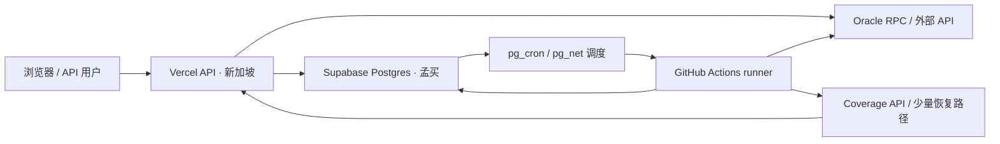

# Insight 整体资源审计与架构优化建议

审计日期：2026-09-27，北京时间。代码基线：`e8b2d37e6a0121b11d5993db41c083fa01de03fe`。范围为 Insight 的 Supabase、Vercel、GitHub Actions、外部数据请求和前端读取链路。

## 结论

优先优化数据库写放大、历史数据容量和重复历史读取。现有“Vercel 提供 API，GitHub runner 执行主要采集，Supabase 保存状态”的分工可以继续使用。仅迁移网站托管平台无法消除数据库的持续采集成本。

需要把四种用途明确分开：最新价格缓存、不可变历史观测、页面展示汇总、实时安全评估。它们可以共享原始读取，但不能共享相同的过期策略或把一次缓存命中当成新的探测证据。

## 实测证据及边界

数据库主快照：15:18:23。补充窗口与缓存统计：15:20—15:25。查询统计最后重置于 **9 月 20 日 15:00:48**；包含优化前后的多个代码版本。数据库自身统计的重置时间为空，与查询统计的口径不能直接混用。

| 项目                     | 实测                                                   | 含义                                                           |
| ------------------------ | ------------------------------------------------------ | -------------------------------------------------------------- |
| Postgres 当前数据库      | 413,093,011 字节，约 394 MiB                           | 这是数据库大小，不是整个磁盘占用，也不是 I/O 预算余额          |
| `price_snapshots`        | 579,809 条估算存活记录，173.8 MiB                      | 15 分钟明细，表与索引合计                                      |
| `hourly_price_snapshots` | 249,589 条估算存活记录，102.9 MiB                      | 每 15 分钟覆盖更新本小时记录                                   |
| 两张价格历史表           | 276.7 MiB，占数据库约 70.2%                            | 容量规划的主要对象                                             |
| public 表索引            | 207.0 MiB，占 public 表总大小约 56.9%                  | 索引读取收益必须与空间、维护写入平衡                           |
| 最近 24 小时价格明细     | 27,014 行，96 个采集槽                                 | 即使无人访问网站也会产生的开销                                 |
| 最近 25 个小时桶         | 7,037 行                                               | 包含仍在形成的当前小时，不能直接当作严格 24 小时增量           |
| 短期价格缓存             | 29,911 条未过期记录，1,870 个 provider/symbol/chain 键 | 平均每键约 16 条，不代表这些全部可以删除                       |
| 同键、同源时间的缓存记录 | 920 组有多条，额外记录 2,482 条                        | 尚未逐条比较价格、签名、信号向量；不能认定为完全相同的证据     |
| `price_records` 插入语句 | 累计 201,057 次，产生约 1.22 GiB WAL                   | 短期缓存是持续写入的重点；WAL 是写日志量，不是当前磁盘文件大小 |
| 最新价格读取语句         | 累计 98,545 次，平均 33.77 ms                          | 查询时间不包含应用到数据库的网络延迟                           |
| feed 注册表两类分页读取  | 累计 15,133 / 69,385 次，平均 70.97 / 14.96 ms         | 已有进程内缓存；还需辨别冷启动和历史版本的贡献                 |
| feed 批量健康更新        | 累计 668 次，约 362 MiB WAL                            | “一次 RPC”内部仍逐行循环更新                                   |
| 小时表 upsert / 明细插入 | 各累计 668 次，约 327 / 337 MiB WAL                    | 双表设计与多次小时内更新的持续成本                             |
| 单条 feed 健康更新       | 累计 89,957 次，约 103 MiB WAL                         | 与新观测、缓存命中和不同任务的边界有关                         |
| Oracle Watch 历史读取    | 累计 10,523 次，平均 51.45 ms                          | 有明确时间边界，但仍每次取原始行并在应用端聚合                 |
| 限流 RPC                 | 累计 1,320 次，约 1 MiB WAL                            | 当前证据不支持把它当成主要资源瓶颈                             |
| cron 原生日志            | 56,530 行，约 11.2 MiB，最早 5 月 11 日北京时间        | 业务调度账本有 30 天保留，原生日志尚未看到同类清理任务         |

以上查询 WAL 不能简单相加当作总磁盘写入；数据库统计、函数内语句归属、检查点与物理磁盘写入是不同口径。`n_live_tup` 和索引使用次数也是统计估计。部分 SELECT 会产生 hint bit 等维护写入，不能因此直接推断存在业务写操作。

### 当前负载与已完成优化

官方 Metrics API 读取成功。15:22:51—15:26:20 的约 209 秒窗口，CPU 时间差中 idle 约 97.2%、iowait 约 2.1%，user+system 约 0.7%；数据盘读约 95 KiB/s、写约 84 KiB/s。部分指标在相邻抓取中完全相同，说明存在采集刷新粒度，不能把短窗口零差值解释成零消耗。这只是当前低负载样本，不能证明高峰或预算恢复。

最后一次抓取的 MemTotal 约 406.5 MiB、MemAvailable 约 184.1 MiB；有已使用 swap，但没有完整的换入换出速率序列，不能据此诊断持续内存抖动。一次数据库连接快照为 13 个 idle 客户端、1 个 active 客户端，不能替代峰值连接数据。

Metrics API 本次提供的 299 个指标名中没有 Disk I/O Burst Balance。当前 burst 余额、完整日/月 Vercel 使用量、各 RPC 供应商配额与账单仍未取得。因此不报告“整体降低了多少百分比”或精确月成本。

今天已发布的 `0062` 和市场参考 RPC 保留有效：市场参考只聚合最新有效小时；训练采用有显式时间 seek 边界的游标；新索引减少相关扫描与排序。15:18—15:25 数据库 `temp_bytes` 没有增加，但该窗口未覆盖一次完整训练，不能视为训练改动的最终效果。此前累计临时文件约 3.58 GiB 大部分来自历史排序查询，不能继续算作新版本当前开销。

## 现有架构与后台固定开销

生产部署实际为 `sin1`，数据库项目实际为 `ap-south-1`。Vercel 项目面板默认值是 `iad1`，但当前部署被 `vercel.json` 覆盖为 `sin1`；不能用面板默认值描述当前部署。项目启用了 Fluid compute。

业务账本最近 24 小时：

| 任务               | Supabase 主调度成功次数 | 账本平均运行时长 | 实际执行位置                                      |
| ------------------ | ----------------------: | ---------------: | ------------------------------------------------- |
| 价格明细与市场参考 |                      96 |          37.1 秒 | GitHub runner；市场参考在同一个 workflow 内       |
| Oracle Watch       |                      48 |          26.3 秒 | GitHub runner                                     |
| Coverage SLO       |                      96 |          16.7 秒 | GitHub runner 发起请求，Vercel 执行探测、保存证据 |
| 声誉计算           |                      24 |          17.3 秒 | GitHub runner                                     |
| 安全结果回填       |                      12 |          19.1 秒 | GitHub runner                                     |
| feed cadence       |                       1 |           3.3 秒 | GitHub runner                                     |
| 日报发布           |                       1 |          19.6 秒 | GitHub runner                                     |

共 278 次主业务任务；另有 Coverage 3 次、日报 1 次和 billing 1 次成功备用/原生执行。以上是业务账本耗时，不包含 runner 排队及全部启动开销，不是计费分钟。

GitHub API 抓取北京 9 月 27 日 00:00 到约 15:15 的 238 条 workflow 记录，包含 PR 校验、跳过任务和取消任务。原生备用调度实际触发次数远少于配置理论值，不能按“每个主任务一定有一个备用 runner”计算消耗。抽查 Coverage 原生运行 `36302366164`，采集步骤被 guard 跳过，只执行启动、checkout 和 freshness 检查。快照、Watch 等主要业务执行次数与主账本一致。

现有仓库为公开项目且使用标准 Linux runner，GitHub 官方说明此类 Actions 运行免费；优化这些任务主要减少资源与故障面，不能直接换算为用户账单节省。当前 CI 的 validate job 运行 `validate:ci:checks`，构建在 smoke job 执行一次，然后生产部署由 Vercel 构建。不能把当前 CI 误报为两个校验 job 都重复完整 build。

## 按优先级实施的建议

### 1. 明确价格缓存写入策略，先消除单条追加写放大

**收益高，实施成本中等。** `snapshotCollector` 已批量写小时表和明细表，却通过 `fetchPriceWithDatabase` 对适用 provider 再逐条、异步追加 `price_records`。API 请求的实时刷新也走相同的追加保存路径。缓存 24 小时物理保留与 30 秒可用新鲜度是两个不同概念，延长 30 秒新鲜度会影响实时安全能力，不能作为默认优化。

先增加明确的调用场景：collector 只返回新观测并在批次结束统一保存；交互式 API 使用短期最新值缓存。第一步可用有界批量插入减少约每 feed 一次 PostgREST 往返，保留同样的记录。随后考虑独立 latest-cache 表按 provider、规范 symbol、chain、必要 source/feed 身份更新，历史观测仍保存在历史表。保存只需要成功状态时，不再 `RETURNING *` 传回完整行。

同源时间的多条记录需按价格及证据指纹核实再去重；不能只按价格相同跳过，也不能把旧 oracle timestamp 改成当前时间。异步写入必须有明确完成/失败归属，避免函数返回后保存未完成却仍计入成功。

验收：分别记录 collector / public read / safety 调用的 cache read、write、WAL 和保存失败；核对返回值、24 小时历史补充字段与 30 秒新鲜度；并发旧数据不能覆盖较新数据；失败与签名字段不能丢失。

### 2. 先规划容量，再审查索引；保留历史能力

**紧迫性高，成本取决于选型。** 以当前行密度、27,014 条明细/日和约 6,756 条小时记录/日做稳态情景，两张价格表保留 120 天约为 **1.28 GiB**，其他业务表尚未计入。约 10.9 MiB/日是按当前表大小均摊的毛增量情景，受到空闲页复用、索引变化、vacuum、采集范围改变影响，不是实测增长曲线，也不能据此承诺某天耗尽。

若项目仍在 Free 计划，官方数据库额度为 500 MB，这个稳态情景无法仅靠现有保留策略容纳。最近的三条性能索引合计约 36.6 MiB，已取得读取收益，同时确实增加空间与写入维护。以七天以上的覆盖工作负载审查零使用/重叠索引，结合历史 API、训练、日报计划、唯一约束与外键，不能仅因为 `idx_scan=0` 就删除。

容量方案有两条：保持原数据库查询能力并按实际峰值升级合适计算/空间；或者建设可验证历史归档，使冷明细进入压缩文件、Postgres 保存最近窗口和必要汇总。后者降低热数据库体积，但增加导出、校验、读取适配和对象存储流量，未必比小规模付费数据库划算。

归档必须先校验时间范围、行数、主键、hash、失败样本与可恢复读取，再切换消费者；训练的八周窗口、公开 90 天历史仍须可读。不能直接把明细改为 7/30 天保留后宣称能力不受影响。仅当前小时表的密度也意味着盲目保留八周所有明细未必能塞进 Free。

增加 `cron.job_run_details` 的有界保留方案，先确认原生日志的审计用途；这是约 11 MiB 的辅助机会，不是容量根治。普通 DELETE 不会立即让文件大小同比下降，空间通常供后续重用，不应在生产热路径直接做阻塞性全表重写。

### 3. 拆出历史汇总读取，共享完成小时的统计

**收益中高，成本中等。** Oracle Watch 与安全评估目前重复拉取约 30 小时的原始成功行，在应用端分组。实测 ETH 717 行、BTC 639 行，当前未超过默认 1,000 行返回上限，但未来扩链后 `.limit(2000)` 不能保证完整。应以完整性检查或数据库聚合解决扩容边界。

先把“读取完成小时的历史基线”与“基于此次 live 值计算特征”拆开。历史读取按 asset、时间边界和数据版本合并并发请求，短 TTL 缓存；后续增量维护小时读模型，只返回约 30 个小时汇总点。迟到数据或小时内更新需要版本失效，当前正在形成的小时继续排除。

每次评估仍用当前 live 值重新计算速度、波动和 z-score，保留精确 T-1/T-3、缺口、参与者定义及训练一致性。现有统计聚合跨哪些链，就应保持哪些链，不能顺手改成按链分组。市场参考今天已有有界 RPC，不必再新建一个缓存层重复它。

feed 注册表已具有 5 分钟进程缓存和并发合并；仍值得让全量缓存一次装载同时供给各 provider 索引。分页 exact count 目前每页重复请求，可改成首屏一次 count 后完整校验，或稳定版本的游标读取，保留此前防止注册表截断的保障。不要取消计数后再次引入少 feed 的错误。

验收：与原实现逐资产比较小时 median、max deviation、参与者数和 ML 特征，覆盖迟到、缺失、失败、小时切换及大于 1,000 行场景；记录每个资产的历史查询次数和响应字节。

### 4. 优化健康状态写入和小时表派生，但保持探测语义

**收益中等，成本中等。** `batch_update_feed_health` 虽是一条 RPC，函数内仍通过两轮 PL/pgSQL 循环逐个 UPDATE。可先去重/分组输入，然后采用集合更新；重复失败的次数、先成功后失败的现有语义、返回计数和停用阈值必须等价。不能简单按时间抽样忽略失败。

中期可把 feed 身份注册表与频繁更新的健康状态拆开，减少注册表反复刷新、扫描与维护写入。但现有 freshness 和停用消费者需要一起迁移，优先于“直接延长所有缓存”的方案。

小时表每 15 分钟更新四次用于当前小时展示。可以研究完成小时派生，当前小时从明细/小型最新状态提供；只有完整列出日报、监控和公开 API 的消费者并验证一致性后才能降低小时 upsert 次数。每 15 分钟明细采集本身先保留，避免牺牲异常信号。

### 5. 降低展示页的请求扇出，并测试区域对齐

**收益随访问量增长，成本低至中等。** `useAllOnChainData` 在没有选定 provider 时，会启用七个 provider 的详情查询，每分钟轮询；其他情况下还可能随 queryResults 启用多个 provider。它已经禁用后台轮询和 focus 重读，不必重复做已有优化。

改为详情区展开且可见时读取；价格比较保留批量端点；低频 metadata 用单独 TTL；错误/不支持来源做有界退避。若把全部七个详情改成一个批量请求，可减少浏览器到函数的请求数，但后端仍需真的共享原始读取，否则 RPC 调用没有同比减少。不能把所有活动页面强行统一为 15 分钟刷新，实时价格与历史统计更新周期不同。

展示汇总由定时任务生成并通过现有 CDN 策略读取。现有公开价格/详情已设置 `s-maxage=5`，半静态数据已有 300 秒缓存，建议针对适合的展示读模型提高命中率，不是全站第一次加缓存。鉴权、计费、签名评估、执行回执以及用户结果继续按其安全语义处理；共享缓存只放不含用户身份、授权与签名评估结果的公开数据。

目前 API 新加坡、数据库孟买，可用隔离预览对比 `sin1` / `bom1` 对数据库密集和 RPC 密集路线的 p50/p95、总网络等待与函数 CPU。Vercel 官方建议函数尽量接近数据库。先验证函数区域比迁移数据库更可逆，不能未测量就承诺延迟或费用降幅。项目已启用 Fluid compute，不能再把“打开 Fluid”当成待实施项。

### 6. 保留可靠调度，减少旁路开销并补足度量

**收益较小，成本低。** 原生备用抽查已正确跳过采集，不建议立即删除备用调度以节省免费 runner。可后续合并低频维护检查、在必要时统一 freshness 检查；保持现有账本、重试、去重、缺失恢复与固定槽 Coverage 语义。

Coverage 每 15 分钟经 Vercel 生成四个目标的采样证据。移到 runner 需要安全迁移签名和 enrollment/immutable-slot 处理；当前只有 96 次/日主任务，不能仅为少量函数调用就扩大签名密钥的分布。优先降低其内部冗余 DB 往返，保留真实端到端探测。

`sync-npm-releases` 每 6 小时执行 `npm ci` 和 cron bundle 重建后才检测变化。可让轻量版本检查先判断是否值得完整安装/校验；有变化时保留现有完整 gate。今天该 workflow 有一个失败，需按日志归因，不能归因于数据库 I/O。

RPC 已有部分进程内缓存、共识读取并发合并、重试与 fallback。再优化时先按 provider/chain/method 统计调用次数、超时和重试放大，URL 及 key 脱敏；稳定 metadata 按地址缓存，同批读取尽量统一 block；支持的链/供应商再使用 batch/multicall。JSON-RPC batch 不必然降低供应商计费单位，不能把 HTTP 请求减少直接当作账单同比减少。

## 建议实施顺序及验收

1. 固化生产观测口径：数据库大小每日变化、按用途的写入、WAL、临时文件增量、DB/API p95、采集缺失槽、RPC retries 和 Vercel 函数/流量。
2. 优先做 collector 缓存批量写入、减少整行返回；补上保存完成归属和真实证据去重边界。
3. 同时完成容量选择与索引审查，避免尚未到 120 天稳态就触及存储额度；归档读取适配必须先于删除。
4. 改历史基线读取与 feed 注册表分页计数，验证等价后再预聚合。
5. 做页面详情按需读取和区域预览对比；依据请求/延迟实测决定是否发布。
6. 最后再考虑任务合并、数据健康表分离和小时读模型替换。

建议至少跨一个完整训练周期、日报与日常清理周期比较新旧窗口；避免压测已经耗尽 burst 的生产实例。成功标准是同样采集覆盖、历史完整性、freshness、失败及签名语义下，减少每批 PostgREST 请求、重复记录与 WAL，且 p95/缺失槽没有恶化。未拿到账单和完整峰值序列前，不能承诺固定降幅。

## 来源

代码定位：`src/lib/oracles/base/databaseOperations.ts`、`src/lib/oracles/utils/storage.ts`、`src/lib/supabase/queries.ts`、`src/lib/reports/snapshotCollector.ts`、`src/lib/reports/loadHourlySnapshots.ts`、`src/lib/api/services/oracleWatchHistory.ts`、`src/lib/api/services/consensusPriceService.ts`、`src/hooks/oracles/useAllOnChainData.ts`、`src/lib/api/utils.ts`、`src/lib/coverage/collector.ts`、`supabase/migrations/0004_functions.sql`、`0043_free_tier_compute_and_retention.sql`、`0062_reduce_snapshot_read_io.sql`、`.github/workflows`、`vercel.json`。

官方资料（本次核实）：

- [Supabase 查询统计](https://supabase.com/docs/guides/database/extensions/pg_stat_statements) 与 [PostgreSQL WAL 统计字段](https://www.postgresql.org/docs/16/pgstatstatements.html)。
- [Supabase 数据库大小与磁盘区别](https://supabase.com/docs/guides/platform/database-size)、[Free 数据库额度](https://supabase.com/pricing) 和 [Metrics API](https://supabase.com/docs/guides/observability/metrics)。
- [Vercel 区域列表与数据库就近原则](https://vercel.com/docs/regions)、[CDN 缓存头](https://vercel.com/docs/caching/cache-control-headers) 和 [用量诊断](https://vercel.com/docs/pricing/manage-and-optimize-usage)。
- [GitHub Actions 公开仓库标准 runner 计费](https://docs.github.com/en/billing/concepts/product-billing/github-actions)。
- [Supabase 改区域需要迁移](https://supabase.com/docs/guides/troubleshooting/change-project-region-eWJo5Z)。

本次只新增审计文档。没有实施上述建议、删除数据、变更采集频率、调整云配置或发布新部署；现有今天发布的 I/O 优化仍保持生产状态。
